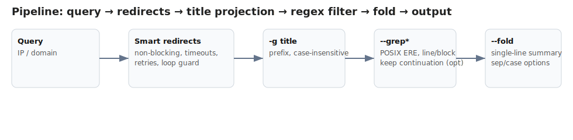
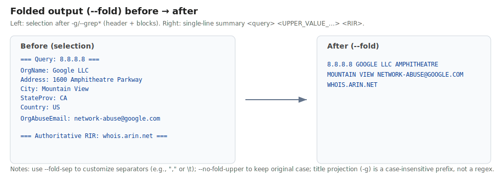

# whois (v3.2.6)

[](https://github.com/larsonzh/whois/releases)
[](https://github.com/larsonzh/whois/releases)
[](LICENSE)
[](https://github.com/larsonzh/whois/actions/workflows/build.yml)
[](https://github.com/larsonzh/whois/releases)

## 概览 / Overview

- 轻量高性能 C 语言 whois 客户端，支持：
	- 批量标准输入模式（`-B`），当 stdin 不是 TTY 时自动启用
	- 适合 BusyBox 管道的稳定输出契约：每条查询首行标题（含起始服务器与其 IP）与末行 Authoritative RIR（含其 IP）
	- 非阻塞连接、I/O 超时、轻量重试、跟随转发（带循环保护）
- Lightweight, high-performance whois client in C with:
	- Batch stdin mode (`-B`), implicitly enabled when stdin is not a TTY
	- Stable output contract for BusyBox pipelines: per-query header (includes starting server + its IP) and authoritative RIR tail (with its IP)
	- Non-blocking connect, IO timeouts, light retries, and referral redirect following with loop guard

亮点：折叠输出（`--fold`、`--fold-sep`、`--no-fold-upper`）与续行关键词命中技巧（策略 A 与策略 B），针对 BusyBox 管道做优化——详见使用文档。
	Highlight: folded output (`--fold`, `--fold-sep`, `--no-fold-upper`) and continuation-line keyword capture tips (Strategy A vs B) designed for BusyBox pipelines — see Usage.

### Why this whois client / 我们的亮点

- Smart redirects / 智能重定向：
	- Auto follow referrals with loop guard and max hops (`-R`, disable with `-Q`); non-blocking connect, timeouts, and light retries ensure responsive queries even on poor links.
	- 自动跟随转发（含循环保护与跳转上限 `-R`，可用 `-Q` 禁用）；非阻塞连接 + 超时 + 轻量重试，在弱网络下也能保持顺滑体验。
- Pipeline batch input / 管道化批量输入：
	- Read from stdin (`-B` or implicit when stdin isn’t a TTY), stable header/tail contract for BusyBox grep/awk pipelines; designed for large-scale classification and logging.
	- 读取标准输入（`-B` 或隐式触发），输出契约稳定，天然适配 BusyBox 的 grep/awk 管道，适合大批量归类与日志流处理。
- Conditional output engine / 条件输出引擎：
	- Title projection (`-g`, case-insensitive prefix) → POSIX ERE filters (`--grep/--grep-cs`, line/block, optional continuation expansion) → folded summarization (`--fold`).
	- 标题投影（`-g`，不区分大小写前缀）→ 正则筛查（`--grep/--grep-cs`，行/块 + 可选续行展开）→ 单行折叠（`--fold`）。

Tiny pipeline sketch / 处理流程一图流：

`query → resolve server → follow referrals → title projection (-g) → regex filter (--grep*) → fold (--fold)`



## Try it / 试试手

```bash
# Linux / Git Bash：在 Linux 或 Git Bash 环境中运行
# Linux / Git Bash: run in Linux or Git Bash
whois-x86_64 8.8.8.8
whois-x86_64 --host apnic -Q 103.89.208.0
printf "8.8.8.8\n1.1.1.1\n" | whois-x86_64 -B -g 'netname|e-mail' --grep 'GOOGLE|CLOUDFLARE' --grep-line --fold
```

```powershell
# Windows PowerShell：在 Windows PowerShell 中运行
# Windows PowerShell: run in Windows PowerShell
whois-x86_64.exe 8.8.8.8
whois-x86_64.exe --host apnic -Q 103.89.208.0
"8.8.8.8`n1.1.1.1" | .\whois-x86_64.exe -B -g 'netname|e-mail' --grep 'GOOGLE|CLOUDFLARE' --grep-line --fold
```

### 文档 TOC / Docs TOC
- 使用说明 / Usage: `docs/USAGE_CN.md` | `docs/USAGE_EN.md`
- 操作与发布 / Operations: `docs/OPERATIONS_CN.md` | `docs/OPERATIONS_EN.md`
 - 链接风格转换 / Link style conversion: `docs/RELEASE_LINK_STYLE.md`

快速导航 / Quick navigation:
- 发布与下载 / Releases:
	<!--
	Maintenance note / 维护说明:
	- Keep releases sorted by newest first (descending).
	- For Release notes anchor, use digits only (e.g., v3.2.5 -> `RELEASE_NOTES.md#325`).
	- Use the bilingual template below when adding a new version.
	- Also update the top title and shields badges to vX.Y.Z (first H1 line and any hard-coded version strings).
	- 同时将顶部标题与徽章版本更新为 vX.Y.Z（第一行 H1 标题及 README 中任何写死的版本号）。
	- Quick tip: copy the previous entry and replace version strings and anchor digits; verify both CN/EN lines.
	- 小贴士：可直接复制上一条，替换版本号与锚点数字，并检查中英文两行是否对应。
    
	Template / 模板：
	- vX.Y.Z：发布说明 `RELEASE_NOTES.md#XYZ` | GitHub Release: https://github.com/larsonzh/whois/releases/tag/vX.Y.Z | Gitee Releases（查找 vX.Y.Z）: https://gitee.com/larsonzh/whois/releases
		- vX.Y.Z: Release notes `RELEASE_NOTES.md#XYZ` | GitHub Release: https://github.com/larsonzh/whois/releases/tag/vX.Y.Z | Gitee Releases (find vX.Y.Z): https://gitee.com/larsonzh/whois/releases
	Example: v3.2.5 -> `#325`.
	-->
	- v3.2.6：发布说明 `RELEASE_NOTES.md#326` | GitHub Release: https://github.com/larsonzh/whois/releases/tag/v3.2.6 | Gitee Releases（查找 v3.2.6）: https://gitee.com/larsonzh/whois/releases
		- v3.2.6: Release notes `RELEASE_NOTES.md#326` | GitHub Release: https://github.com/larsonzh/whois/releases/tag/v3.2.6 | Gitee Releases (find v3.2.6): https://gitee.com/larsonzh/whois/releases
	- v3.2.5：发布说明 `RELEASE_NOTES.md#325` | GitHub Release: https://github.com/larsonzh/whois/releases/tag/v3.2.5 | Gitee Releases（查找 v3.2.5）: https://gitee.com/larsonzh/whois/releases
		- v3.2.5: Release notes `RELEASE_NOTES.md#325` | GitHub Release: https://github.com/larsonzh/whois/releases/tag/v3.2.5 | Gitee Releases (find v3.2.5): https://gitee.com/larsonzh/whois/releases
	- v3.2.3：发布说明 `RELEASE_NOTES.md#323` | GitHub Release: https://github.com/larsonzh/whois/releases/tag/v3.2.3 | Gitee Releases（查找 v3.2.3）: https://gitee.com/larsonzh/whois/releases
		- v3.2.3: Release notes `RELEASE_NOTES.md#323` | GitHub Release: https://github.com/larsonzh/whois/releases/tag/v3.2.3 | Gitee Releases (find v3.2.3): https://gitee.com/larsonzh/whois/releases
	- v3.2.2：发布说明 `RELEASE_NOTES.md#322` | GitHub Release: https://github.com/larsonzh/whois/releases/tag/v3.2.2 | Gitee Releases（查找 v3.2.2）: https://gitee.com/larsonzh/whois/releases
		- v3.2.2: Release notes `RELEASE_NOTES.md#322` | GitHub Release: https://github.com/larsonzh/whois/releases/tag/v3.2.2 | Gitee Releases (find v3.2.2): https://gitee.com/larsonzh/whois/releases
	- v3.2.1：发布说明 `RELEASE_NOTES.md#321` | GitHub Release: https://github.com/larsonzh/whois/releases/tag/v3.2.1 | Gitee Releases（查找 v3.2.1）: https://gitee.com/larsonzh/whois/releases
		- v3.2.1: Release notes `RELEASE_NOTES.md#321` | GitHub Release: https://github.com/larsonzh/whois/releases/tag/v3.2.1 | Gitee Releases (find v3.2.1): https://gitee.com/larsonzh/whois/releases
  

## v3.2.6 速览 / What's new <a id="326"></a>

- 重构与行为一致性：抽离 WHOIS 重定向检测/解析为独立模块（wc_redirect），统一大小写不敏感的重定向信号，移除 APNIC 特例；最小化重定向目标校验避免本地/私网目标。
	- Refactor & consistency: extract redirect logic into wc_redirect; unify case-insensitive redirect flags; remove APNIC-only branch; add minimal redirect-target validation.
- IANA 优先策略：跨 RIR 跳转时保证先经 IANA 一跳（若尚未访问），提升“权威 RIR”判定与尾行稳定性。
	- IANA-first policy to stabilize authoritative resolution and tail-line.
- 输出契约对齐：标题行采用“via <别名或域名> @ <连接 IP|unknown>”，尾行在权威为 IP 字面量时回映射为 RIR 域名，@ 段仍保留 IP/unknown。
	- Output contract alignment: header and tail as specified; literals canonicalized to RIR hostnames.
- 内置自测增强：新增重定向自测（needs_redirect/is_authoritative_response/extract_refer_server），与折叠自测一并执行；可编译开启 GREP/SECLOG 自测。
	- Selftests: redirect tests added; GREP/SECLOG tests available via compile-time switches.

参考与下载 / Links
- 发布说明 / Release notes: `RELEASE_NOTES.md#326`
- 使用说明 / Usage: CN `docs/USAGE_CN.md` | EN `docs/USAGE_EN.md`
- GitHub 发布 / GitHub Release: https://github.com/larsonzh/whois/releases/tag/v3.2.6
- Gitee 发布 / Gitee Releases: https://gitee.com/larsonzh/whois/releases （查找 v3.2.6）

## v3.2.5 速览 / What's new <a id="325"></a>

- 稳定里程碑：在继续拆分（opts/net/cache）前冻结正确性与诊断，为下游提供安全基线。
	- Stability milestone: freeze correctness & diagnostics before further modular splits (opts/net/cache) to give downstream a safe baseline.
- 模块化第一步：抽离条件输出逻辑为 `wc_title`、`wc_grep`、`wc_fold`、`wc_output`、`wc_seclog`；新增 `src/core/pipeline.c` 预留后续编排；行为保持不变。
	- Modularization step 1: extract conditional output into `wc_title`, `wc_grep`, `wc_fold`, `wc_output`, `wc_seclog`; add `src/core/pipeline.c` for future orchestration; behavior preserved.
- GREP 自测钩子：编译加 `-DWHOIS_GREP_TEST`，运行设 `WHOIS_GREP_TEST=1`，自动验证 block / line / line+cont，输出 `[GREPTEST] ... PASS`；失败打印诊断。
	- GREP self-test hook: build with `-DWHOIS_GREP_TEST`; run with `WHOIS_GREP_TEST=1` to validate block/line/line+cont; emits `[GREPTEST] ... PASS` or diagnostics on failure.
- 续行启发式改进（块模式）：仅保留首个“类似标题缩进行”；后续同类缩进行需匹配正则才保留，避免引入无关字段。
	- Improved block-mode continuation heuristic: keep only first header-like indented line; later header-like indented lines must match regex to be kept.
- 远程构建诊断增强：打印 LDFLAGS_EXTRA、UPX 可用与压缩率、QEMU vs 原生 smoke runner。
	- Remote build diagnostics: include LDFLAGS_EXTRA, UPX availability/compression, and QEMU vs native smoke runner info.
- 文档更新：新增 grep 自测章节；解释 `wc` 前缀；清理遗留非英文注释。
	- Docs updated: add grep self-test section; clarify `wc` prefix; remove leftover non-English comments.

参考与下载 / Links
- 发布说明 / Release notes: `RELEASE_NOTES.md#324`
- 使用说明 / Usage: CN `docs/USAGE_CN.md` | EN `docs/USAGE_EN.md`
- GitHub 发布 / GitHub Release: https://github.com/larsonzh/whois/releases/tag/v3.2.5
- Gitee 发布 / Gitee Releases: https://gitee.com/larsonzh/whois/releases （查找 v3.2.5）

## v3.2.3 速览 / What's new <a id="323"></a>

- 输出契约细化：标题与尾行显示服务器 IP（解析失败为 `unknown`），并对别名先映射再解析，避免 "via apnic @ unknown"。
	- Output contract refinement: header and tail now include server IPs (`unknown` on DNS failure); aliases mapped before resolution to avoid false "via apnic @ unknown" cases.
- 折叠输出（`--fold`）保持既有单行格式 `<query> <UPPER_VALUE_...> <RIR>`，不包含服务器 IP，确保下游管道稳定。
	- Folded output (`--fold`) retains the single-line form `<query> <UPPER_VALUE_...> <RIR>` without server IPs to keep downstream pipelines stable.
- 新增 ARIN IPv6 连通性提示：私网 IPv4 源可能被拒，建议启用 IPv6 或走公网出口（详见 USAGE）。
	- Add ARIN IPv6 connectivity tip: private IPv4 source may be rejected; enable IPv6 or use public egress (see Usage).

Links / 参考:
- 发布说明 / Release notes: `RELEASE_NOTES.md#323`
- 使用说明 / Usage: CN `docs/USAGE_CN.md` | EN `docs/USAGE_EN.md`
- GitHub 发布 / GitHub Release: https://github.com/larsonzh/whois/releases/tag/v3.2.3
- Gitee 发布 / Gitee Releases: https://gitee.com/larsonzh/whois/releases （查找 v3.2.3）

## v3.2.2 速览 / What's new

- 安全加固（九大领域）与可选安全日志：
	- 新增 `--security-log`（默认关闭）：将安全事件输出到 stderr，便于调试与审计；不改变既有 stdout 输出契约。
		- Add `--security-log` (off by default): emits SECURITY events to stderr; stdout contract unchanged.
	- 安全日志已内置限频：避免在攻击/洪泛时刷屏（约 20 条/秒，超额抑制并定期汇总提示）。
		- Rate-limited output (~20 events/sec) with suppression summaries to avoid flooding.
	- 领域覆盖：内存安全辅助（safe_ 系列）、改进的信号处理与清理、输入/查询与长度/字符集校验、网络连接与重定向安全（含目标校验/环路/注入识别）、响应净化与校验（移除控制/ANSI 序列等）、配置校验、线程安全与缓存一致性（加锁/失效）、协议级异常检测与告警。
		- Coverage: safer memory helpers, improved signal handling/cleanup, strict input/query validation, secure redirects (target validation/loop/injection checks), response sanitization/validation (strip control/ANSI), configuration validation, thread-safety with cache integrity, protocol anomaly detection.
	- 版本命令与帮助已更新（`--version`、`--help`）。
		- `--version`/`--help` updated.

- 兼容性说明 / Compatibility:
	- 移除此前的 RDAP 实验功能与所有相关开关，保持经典 WHOIS 纯文本语义与工作流。
		- Remove previous experimental RDAP features/switches to keep classic WHOIS-only behavior.

参考与下载 / Links
- 发布说明 / Release notes: `RELEASE_NOTES.md#322`
- 使用说明 / Usage: CN `docs/USAGE_CN.md` | EN `docs/USAGE_EN.md`
- GitHub 发布 / GitHub Release: https://github.com/larsonzh/whois/releases/tag/v3.2.2
- Gitee 发布 / Gitee Releases: https://gitee.com/larsonzh/whois/releases （查找 v3.2.2）

## v3.2.1 速览 / What's new

- 正则过滤与选择模式：新增 `--grep/--grep-cs`，支持行/块选择（`--grep-line`/`--grep-block`），并提供续行展开开关（`--keep-continuation-lines`）。
	- Regex filters and selection modes: add `--grep/--grep-cs`; support line/block selectors (`--grep-line`/`--grep-block`); optional block expansion in line mode (`--keep-continuation-lines`).
- 兼容原有 -g/--title 语义：`-g` 为不区分大小写的“前缀匹配”（非正则）；处理顺序保持为“先按标题投影，再做正则过滤”。
	- Preserve `-g/--title` semantics as case-insensitive prefix match (NOT regex); pipeline remains "title projection first, then regex filter".
- BusyBox 友好默认：输出契约不变；在 lzispro 中默认使用“行模式 + 不展开续行”，可通过环境变量回退或切换。
	- BusyBox-friendly defaults: output contract unchanged; lzispro defaults to "line mode + no continuation expansion", overridable via env vars.
- 稳定性增强：缓存连接存活性改用 `getsockopt(SO_ERROR)` 校验并在异常时清理。
	- Stability: cached-connection aliveness via `getsockopt(SO_ERROR)` with cleanup on error.
- 文档与流程：中英 USAGE 与操作手册更新；完善 Gitee Release 发布与“手动补发”工作流。
	- Docs & Ops updated (CN/EN); Gitee Release supports `target_commitish` and a manual backfill workflow.
- 产物：除 CI 动态 x86_64 外，提供 7 个全静态多架构二进制；附远程交叉编译与冒烟测试脚本。
	- Artifacts: CI x86_64-gnu plus seven fully static multi-arch binaries; remote cross-compile and QEMU smoke-test scripts.

参考与下载 / Links
- 发布说明 / Release notes: `RELEASE_NOTES.md#321`
- 使用说明 / Usage: CN `docs/USAGE_CN.md` | EN `docs/USAGE_EN.md`
- GitHub 发布 / GitHub Release: https://github.com/larsonzh/whois/releases/tag/v3.2.1
- Gitee 发布 / Gitee Releases: https://gitee.com/larsonzh/whois/releases （查找 v3.2.1）

### 近期更新（v3.2.1 引入特性摘要） / Recent updates (introduced in v3.2.1)

- 可选折叠输出（--fold）：将筛选后的正文折叠为单行输出，格式为 `<query> <UPPER_VALUE_...> <RIR>`，便于 BusyBox 管道直接聚合与判定（默认关闭）。
	- Optional folded output (`--fold`): print a single folded line per query using the current selection, in the form `<query> <UPPER_VALUE_...> <RIR>`; handy for BusyBox pipelines (disabled by default).
- 支持 `--fold-sep <SEP>` 自定义分隔符（默认空格，支持 `\t/\n/\r/\s`），以及 `--no-fold-upper` 保留原大小写（默认转为大写）。
	- Supports `--fold-sep <SEP>` to customize the separator (default space; supports `\t/\n/\r/\s`) and `--no-fold-upper` to preserve original case (defaults to uppercase).

- 文档新增：续行关键词命中技巧（推荐策略 A：`-g` + 块模式 `--grep` + `--fold`；可选策略 B：行模式 OR + `--keep-continuation-lines` + `--fold`），并说明行模式为“逐行”匹配，`\n` 不跨行。
	- Docs addition: continuation-line keyword capture tips (recommended Strategy A: `-g` + block mode `--grep` + `--fold`; optional Strategy B: line-mode OR + `--keep-continuation-lines` + `--fold`), clarifying that line mode matches per line and `\n` does not span lines.
	- CN: `docs/USAGE_CN.md#续行关键词命中技巧推荐策略与陷阱` | EN: `docs/USAGE_EN.md#continuation-line-keyword-capture-tips-recommended`

## 示例图 / Example

折叠前后（示意）：



## 开发路线图 / Roadmap

- 条件输出（Phase 2.5）RFC（中文）：`docs/RFC-conditional-output-CN.md`

## 构建 / Build

- Linux / macOS / MSYS2(Windows) / WSL:
	- 默认构建：
		- Default build:
			- `make`
	- 静态链接（可选，取决于工具链是否支持 glibc/musl 静态）：
		- Static link (optional; depends on toolchain support for glibc/musl static):
			- `make static`

提示 / Notes:
- Windows 原生 MinGW 亦可，但推荐 MSYS2 或 WSL 以获得接近 Linux 的构建环境。
	- Windows native MinGW also works, but MSYS2 or WSL is recommended for a Linux-like environment.
- 若静态链接失败，属于平台库限制，建议继续使用动态链接目标。
	- If static linking fails, it's likely due to platform library limitations; continue using the dynamic target.

## 运行示例 / Run examples

- 单条查询
	- Single query
	- `./whois-client 8.8.8.8`
- 指定起始服务器查询
	- Query with specified starting server
	- `./whois-client --host apnic -Q 103.89.208.0`
- 管道批量查询
	- Pipeline batch query
	- `cat ip_list.txt | ./whois-client -B --host apnic`

## 打包 / Packaging (Windows PowerShell)

- 打包命令：
	- Packaging command:
		- `tools/package_artifacts.ps1 -Version 3.2.3`
- 产物布局：`dist/whois-<version>/{bin/<arch>, docs, src, licenses}`，并生成 `SHA256SUMS.txt` 与 ZIP。
	- Layout: `dist/whois-<version>/{bin/<arch>, docs, src, licenses}` with `SHA256SUMS.txt` and a ZIP archive.

## CI

- GitHub Actions（Ubuntu）自动构建；推送形如 `vX.Y.Z` 的标签会自动创建 Release 并附带二进制与校验文件。
	- GitHub Actions (Ubuntu) builds automatically; pushing a tag like `vX.Y.Z` creates a Release with binaries and checksum files.

- 也支持从 GitHub App 或网页手动触发 `workflow_dispatch`：在输入框填写 tag（支持 `v3.2.5` / `3.2.5` / `V3.2.5`，会自动裁剪空格并规范化为 `vX.Y.Z`）。
	- You can also trigger `workflow_dispatch` from the GitHub mobile app or web UI: enter the tag (`v3.2.5` / `3.2.5` / `V3.2.5` accepted; whitespace is trimmed and normalized to `vX.Y.Z`).

## 默认重试节奏 / Retry pacing defaults

- 默认参数：timeout 5s、retries 2、retry-interval 300ms、retry-jitter 300ms
	- Defaults: timeout 5s, retries 2, retry-interval 300ms, retry-jitter 300ms
- 可通过参数调整，详见 USAGE 文档。
	- Adjustable via CLI options; see the USAGE docs for details.

## 许可证 / License

- GPL-3.0-or-later
	- Licensed under GPL-3.0-or-later.

## 远程交叉编译 / Remote cross-compilation

- 推荐在 Ubuntu 虚拟机进行静态交叉编译，使用脚本：
	- 本地启动器：`tools/remote/remote_build_and_test.sh`
		- Local launcher: `tools/remote/remote_build_and_test.sh`
	- 远端构建器：`tools/remote/remote_build.sh`
		- Remote builder: `tools/remote/remote_build.sh`
- 目标架构：`aarch64 armv7 x86_64 x86 mipsel mips64el loongarch64`
	- Targets: `aarch64 armv7 x86_64 x86 mipsel mips64el loongarch64`
- 产物输出：`out/artifacts/<timestamp>/build_out/whois-*`
	- Artifacts: `out/artifacts/<timestamp>/build_out/whois-*`
- 存储与清理：
	- 自 v3.2.0 起，`out/artifacts/` 已加入 `.gitignore`，不再被版本库跟踪；如需本地清理旧运行，可使用 `tools/dev/prune_artifacts.ps1`（支持 `-DryRun`）。
		- Since v3.2.0, `out/artifacts/` is ignored by Git and no longer tracked; to clean up old local runs, use `tools/dev/prune_artifacts.ps1` (supports `-DryRun`).
- 可选同步：
	- 可以使用 `-s <dir>` 将 whois-* 同步到外部目录，例如：`D:/LZProjects/lzispro/release/lzispro/whois`
		- You can use `-s <dir>` to sync whois-* artifacts to an external directory, e.g., `D:/LZProjects/lzispro/release/lzispro/whois`.
	- 配合 `-P 1` 可在同步前清理该目录的非 whois-* 文件，从而实现“仅保留 7 个架构二进制”的要求。
		- With `-P 1`, clean non whois-* files in that directory before syncing to keep only the seven architecture binaries.
	- 多路径同步：`-s "/d/path/one;/d/path/two"`（或用逗号分隔）可同时同步到多个目录；脚本会自动规范 Windows 路径（如 `D:\path` → `/d/path`）。
		- Multi-target sync: `-s "/d/path/one;/d/path/two"` (or comma-separated) to sync to several folders at once; script auto-normalizes Windows paths (e.g. `D:\path` → `/d/path`).

- 冒烟测试：
	- 默认联网（`SMOKE_MODE=net`），不再将公网地址替换为私网地址；失败会如实反映超时/连不通场景。
		- By default (`SMOKE_MODE=net`), we no longer replace public addresses with private ones; failures accurately reflect timeouts/unreachable cases.
	- 自定义目标可用环境变量 `SMOKE_QUERIES` 或参数 `-q "8.8.8.8 example.com"` 指定（空格分隔）。
		- Customize targets via `SMOKE_QUERIES` env var or the `-q "8.8.8.8 example.com"` argument (space-separated).
