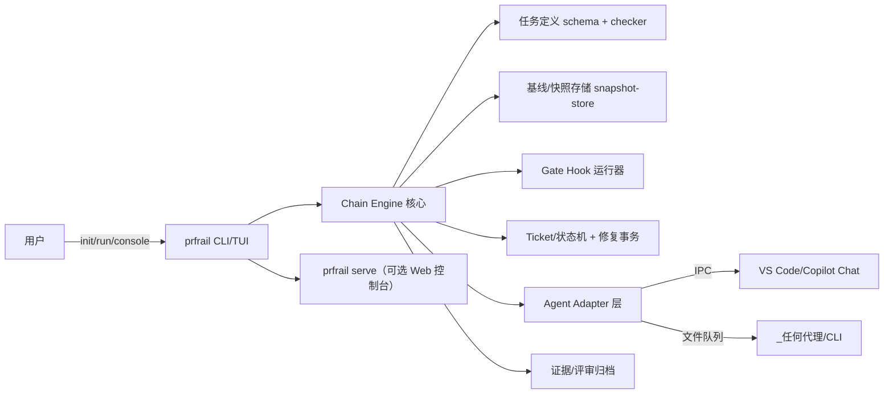

# RFC：ProofRail（证轨）—— AI 无人值守工程通用产品抽取方案

> 状态：提案（Proposal），产品设计基线 v0.1（2026-08-28）。本文将 whois 项目中沉淀的
> AI 无人值守工程实践抽象为独立通用产品，并给出范围、领域模型、架构、安全边界与实施路线。
>
> 来源：基于对本仓库 `tools/test/`（约 125 个无人值守脚本）、`testdata/`（V1/Vx 任务定义体系）
> 与 `docs/`（RFC 与操作流程文档）的实战资产盘点。
>
> 本文已经按 R1–R22 完成合并审计；各节共同构成同一份设计基线，不再采用“后文覆盖前文”的
> 补丁式解释。第 9 节记录需求决策，第 10–13 节定义规范性设计，第 14 节是唯一实施路线。

## 0. 项目命名

### 0.1 正式名称（推荐）

**ProofRail**（紧凑标识：**PrfRail**；工程名称：`prfrail`；中文名：**证轨**）

- 标语（Tagline）：*Provable rails for unattended AI engineering* —— 为 AI 无人值守编程铺设可证明的轨道。
- 命名解读：
  - **Proof（证明）**：直指本体系最核心的差异化能力——哈希绑定产物、幂等 marker、
    精确断言、promotion receipt 构成的"可证明写入"模型。AI 的每一次代码变更都有
    机器可验证的证据链，而非"跑完即信"。
  - **Rail（轨道/护栏）**：双关语义。既是 *guardrail*（护栏）——编辑边界矩阵、停机门禁、
    fail-close 状态机对 AI 权限的最小化约束；也是 *rail*（轨道）——first-fail-stop 的
    顺序执行语义让 AI 只能沿预定义轨道推进，不能自由发挥。
  - 正式名称完整表达产品定位；工程名称短小，适合作为仓库名、CLI、包名和模块前缀。
  - 中文名"证轨"两字对应 Proof/Rail，紧凑且技术气质鲜明。

### 0.2 名称分层与使用规范

采用 **ProofRail / PrfRail / `prfrail`** 的三级命名组合：

| 使用场景 | 写法 | 说明 |
|----------|------|------|
| 正式品牌、标题、对外文档 | **ProofRail** | 保留 Proof + Rail 的完整语义与品牌辨识度 |
| 紧凑视觉标识、空间受限界面 | **PrfRail** | 由 ProofRail 压缩而来，不将 `PR` 突出为独立缩写 |
| 仓库、CLI、可执行文件、包名和模块前缀 | `prfrail` | 全小写、无连字符，便于跨平台使用与检索 |
| 中文文档与传播 | **证轨** | 对应“证明/证据链 + 轨道/护栏” |

推荐示例：

```text
正式名称：ProofRail
紧凑标识：PrfRail
仓库名称：prfrail
CLI：prfrail
Go 模块：github.com/<org>/prfrail
中文名称：证轨
```

CLI 命令示例：

```bash
prfrail check
prfrail apply
prfrail verify
prfrail guard
prfrail inspect
prfrail promote
```

不建议将 **PRail** 作为正式名称或主要简称：在软件工程语境中，`PR` 通常首先被理解为
*Pull Request*，容易让产品被误认为仅面向 PR 检查或 PR 流水线。`PrfRail` 保留了
Proof 的来源提示，同时通过工程名称 `prfrail` 降低重名与语义歧义风险。

命名一致性规则：

1. README、RFC、官网和发布说明首次出现时使用 **ProofRail**。
2. 紧凑界面可使用 **PrfRail**，但首次出现时应注明其为 ProofRail 的紧凑标识。
3. 代码、命令、目录、制品和配置键统一使用小写 `prfrail`，避免混用 `prail`、`proofrail`
   或不同大小写变体。
4. 名称可用性会随时间变化；正式创建独立项目或商业发布前，应再次检查 GitHub、域名、
   语言包注册表及目标市场商标。

### 0.3 备选名称

| 备选 | 解读 | 未选为首选的原因 |
|------|------|------------------|
| **Veritask**（真验任务） | veritas（真理）+ task，强调任务执行的可验证性 | 侧重"任务"层，未覆盖护栏/边界语义 |
| **AegisPilot**（神盾领航） | Aegis（宙斯之盾）+ Pilot（领航/autopilot） | "Pilot" 在 AI 编码领域已被高度占用（Copilot 等），易混淆 |
| **SentinelForge**（哨兵工坊） | 哨兵（guard/watchdog）+ 锻造（代码变更） | 偏向监控语义，弱化了"可证明"这一核心卖点 |
| **FailClose** | 直接取自体系的核心安全原则 | 作为原则名极佳，但作为产品名偏负面 |

### 0.4 子模块命名建议

沿用铁路隐喻，并统一使用 `prfrail` 工程前缀：

- `prfrail-switch`（taskdef）：任务定义 schema 与静态 checker——"道岔"决定轨道走向。
- `prfrail-track`（applier）：原子执行引擎——列车只能沿轨道行驶。
- `prfrail-signal`（tickets）：票据生命周期与状态机——"信号灯"控制放行与阻断。
- `prfrail-guard`（guard）：进程监控与停机门禁。
- `prfrail-depot`（repair）：Prepare/Inspect/Validate/Promote 候选事务——"检修库"。
- `prfrail-gates`（gates）：可插拔验证门禁。

## 1. 总体结论：可行，且价值明确

whois 项目中的无人值守工程已经沉淀了一套完整、经过实战验证的体系，其核心思想与
whois 业务本身高度解耦，具备抽取为通用产品的条件。它解决的是一个通用问题：
**如何让 AI 代理在无人值守条件下安全、可审计、可恢复地执行代码变更任务**。
目前市面上的 AI 编码代理普遍缺乏这一层"工程化护栏"，这正是 ProofRail 的差异化定位。

### 1.1 产品目标与首版边界

ProofRail 的目标用户是需要长时间运行 AI 工程任务、又必须保留审批权和审计证据的个人开发者、
项目维护者与小型工程团队。产品负责从工作区快照、任务链执行、代理投递、门禁验证、任务后评审，
直到结果归档的完整控制闭环。

首版必须做到：

- 任意长度的有序任务链可暂停、恢复，并从最后一个已接受快照继续；
- 默认不读取或修改 Git 历史，不执行提交、推送、分支切换或工作树回滚；
- 每次变更、门禁、评审、恢复均有版本化、哈希绑定、可离线核验的证据；
- 核心对语言、编辑器和 AI 提供方无感知，通过 harness 与 adapter 扩展；
- 无 AI、AI 不可用或人工拒绝时，系统可安全暂停而不是绕过门禁。

### 1.2 非目标

ProofRail 首版不是代码托管平台、CI 服务、通用项目管理工具、独立大模型、完整聊天产品，
也不承诺替代 IDE、编译器、语言运行时或项目自身测试设施。它编排并证明这些外部能力的执行，
但不把外部工具打包进核心二进制。需求分析到测试规划的前期工作流属于 S3 候选，不阻塞 S1。

## 2. 可抽取的核心资产盘点

从仓库现状看，与 whois 业务无关、可通用化的资产包括：

1. **任务定义 Schema（结构规范）与静态检查体系**
   - V1 单文件 / Vx 多文件任务定义模型（target registry、稳定 target id、lifecycle、
     operation 全局排序）。
   - 独立 checker 的顺序内存文本语义、first-fail-stop、幂等 marker、pattern 收敛、
     replay 稳定性、精确 postApplyAssertions。
   - 哈希绑定产物（manifest/payload/target_set_sha256）。

2. **原子执行引擎（code-step）**
   - "读 → 全量预验证 → journal → 逐文件原子写入 → 写后验证 → 失败整组回滚"的事务模型。
   - journal/receipt/state 协议（可恢复提交）。

3. **票据驱动的故障处理与自愈框架**
   - guard/trigger/dispatch 的事件产票、结构化 category（task-static / code-fix / noncode）、
     fail-close 门禁。
   - 相同指纹预算三段状态机（pending_review → override_window → hard_block）、
     有效修复证据判定、防无限循环保护。
   - Prepare → Inspect → Validate → Promote 的隔离候选事务（candidate + 哈希绑定 +
     原子提升 + promotion receipt）。

4. **权限与边界模型**
   - 停机后才允许故障动作、只读状态票、跨轮次修改边界矩阵、轮次归属不可转移、
     编辑工具白名单/黑名单。
   - 自愈开关（self-heal enabled、cross-round repair enabled）与人工解锁规则。

5. **运行编排与可观测性**
   - stage window（监控链启动器）/ session guard（已合并原 supervisor/companion 功能）/
     takeover trigger / terminal watchdog 的进程编排。
   - 工单轮询 V2 的生命周期状态机、账本持久化、重启屏障、drain/recovery-drain。
   - start-file 身份绑定、快照完整性校验、心跳与健康检查。

6. **方法论文档**
   - 操作流程、授权边界（用户确认门禁）、任务切片设计与合并原则、低成本模型操作
     清单——这些是产品"最佳实践手册"的雏形。

## 3. 需要剥离的 whois 耦合点

- D1–D4/V1–V4 轮次语义中与 whois 编译/黄金/Step47 验证绑定的部分 → 抽象为可插拔的
  "验证阶段"接口，由使用方注入自己的构建/测试命令。
- C 语法门禁、`src/core/.task-static-*.c` 等语言特定检查 → 抽象为按语言可扩展的
  syntax gate 插件。
- VS Code 聊天投递中的成熟 IPC 语义 → 抽象为本地“代理通道适配器”；AHK、剪贴板、键盘模拟
  与窗口焦点控制直接淘汰。IDE 与 CLI 代理使用同一票据/回执契约。
- Windows/PowerShell 强绑定 → 见语言选择。

## 4. 语言与技术选型建议

当前实现以 PowerShell 5.1 为主，存在跨平台、可测试性、类型安全的天花板。建议：

- **核心引擎：Go**。理由：单二进制分发（与 whois 项目自身的 BusyBox 兼容哲学一致）、
  跨平台（Windows/Linux/macOS）、强并发原语适合进程编排与 watchdog、标准库覆盖文件
  原子操作与哈希、生态中已有成熟的正则/JSON Schema 工具。Rust 也可行，但 Go 的开发
  迭代速度更适合这个以流程编排为主的领域。
- **任务定义格式：保留 JSON（JSON Schema 正式化）**，同时评估提供 YAML/TOML 前端以
  改善人工可读性，内部统一规范化为 canonical JSON 后再做哈希绑定。
- **代理接口：定义协议而非绑定实现**。首版仅提供本地 IPC 与文件队列，两者共享结构化
  票据、租约、回执和幂等语义；CLI 代理通过文件队列接入。MCP 或远程 API 仅作为后续 adapter
  候选，不进入 v1 核心协议与安全承诺。
- **保留 PowerShell 兼容层（过渡期）**：为现有 whois 流程提供薄封装，使 whois 成为
  ProofRail 的第一个 dogfooding 用户，验证等价性后逐步切换。

## 5. 产品形态与模块划分

建议建立名为 `prfrail` 的独立仓库，模块划分（括号内为 0.4 节的品牌化命名）：

1. `chain`：任务链调度、状态转换、暂停/恢复、锁与策略解析。
2. `taskdef`（switch）：任务定义 schema、解析、target registry、静态 checker。
3. `snapshot`：工作区捕获、内容寻址存储、恢复、保留与垃圾回收。
4. `applier`（track）：原子执行引擎（journal、原子写、回滚、receipt）。
5. `tickets`（signal）：票据生命周期、账本、去重、租约、指纹预算。
6. `guard`（guard）：进程监控、健康检查、停机门禁、watchdog。
7. `repair`（depot）：Prepare/Inspect/Validate/Promote 候选事务。
8. `gates`（gates）：可插拔验证门禁（syntax gate、构建、测试、黄金对比）。
9. `adapters`：本地 IPC、文件队列、AI/编辑器适配；不得被核心模块反向依赖。
10. `console`：CLI/TUI 与可选 Web 控制台，只调用控制面 API，不直接改运行状态文件。
11. `evidence`：事件日志、证据包、评审 receipt、签名/校验与报告导出。
12. `docs`：规范、用户与操作员手册、harness 示例和迁移指南。

## 6. 实施原则与迁移策略

第 14 节的 S0–S3 是本文唯一实施路线。本节只定义跨阶段都必须遵守的迁移原则：

1. **先规范、后实现**：先冻结领域模型、Schema、状态机和证据协议，再编写执行引擎。
2. **独立实现、等价验证**：Go 引擎不翻译 PowerShell 脚本；仅以既有行为和测试证据作为
  参照，通过同输入、同结果、同失败分类的契约测试验证。
3. **影子运行、显式切换**：whois 先作为只读观察的 dogfooding 样例；新旧判定一致且完成
  回滚演练后，才由用户显式选择 ProofRail 执行，禁止自动替换现有无人值守流程。
4. **核心不反向依赖样例**：whois 的 D/V 轮次、Step47、C 语法门禁和 PowerShell 兼容层
  只能存在于 harness 或迁移适配器中，不得进入核心领域模型。
5. **协议版本化**：持久化 Schema、票据、receipt 和快照 manifest 均带独立版本；读取器
  明确声明兼容范围，未知主版本必须 fail-close。

## 7. 关键风险与对策

- **规则复杂度过高吓退新用户**：现有体系为 whois 场景全量启用；产品化时应设计
  "分级模式"（基础原子应用 → 加票据自愈 → 加全套门禁），默认最小化配置。
- **双实现漂移**：阶段二/三必须以等价性测试为门禁，任何语义差异 fail-close，
  禁止"差不多就行"。
- **中文文档的国际化成本**：核心规范优先英文化，操作经验类文档可后置。
- **代理生态变化快**：把代理接口做成薄协议层，核心引擎不感知具体代理，降低生态
  变动冲击。
- **宿主 IPC 能力不稳定或不公开**：S0 必须验证 VS Code/Copilot 宿主可用接口；adapter 版本与宿主
  版本建立兼容矩阵。接口不可用时显式暂停或改用用户预授权的文件队列，不采用 GUI 注入兜底。
- **隔离能力跨平台不一致**：S1 不承诺强安全沙箱，只承诺独立运行工作区、进程与路径边界；
  容器/OS 沙箱能力必须探测并如实标级，不得把目录隔离宣传为恶意代码隔离。
- **大仓库快照成本**：内容去重、增量 manifest、配额预检和保留策略并用；性能优化不得牺牲
  baseline 不可变与证据完整性。
- **whois 自身演进冲突**：抽取期间 whois 的 Vx schema 处于冻结/慢改状态是有利窗口；
  建议在抽取仓库建立后，whois 侧新增无人值守能力一律先在 ProofRail 中实现再回灌。

## 8. 最有价值的独特卖点（产品定位参考）

- 首错即停 + 哈希绑定产物 + 原子提交回滚的"可证明写入"模型。
- 相同指纹预算与有效修复证据判定的"防 AI 无限循环"机制。
- 编辑边界矩阵与停机门禁的"AI 权限最小化"模型。
- 隔离候选事务（candidate 不污染正式定义）的自愈安全模型。

这四点在现有 AI 编码工具生态中均属稀缺，是 ProofRail 的核心竞争力所在，
也是"Proof + Rail"命名所直接指向的产品灵魂。

### 8.1 一句话定位（推荐措辞）

**主推（中英双语）**：
- 中文：ProofRail 为 AI 无人值守编程铺设可证明的轨道——代码变更、门禁、证据、回滚，全程可审计。
- 英文：*Provable rails for unattended AI engineering — every code change, gate, evidence and rollback is auditable.*

**价值主张（Pitch）**：
> ProofRail 让 AI 在无人值守下安全地改代码、跑验证、出证据：每一步都可验证、可回滚、
> 可审计，人的审批始终保留在关键节点。

**差异化一句话**：
> 不是又一个“帮我写代码”的助手——ProofRail 是 AI 编码的工程轨道：任务链、门禁、快照、
> 证据、回滚全部机器可验证，且不绑定任何语言、编辑器或模型。

### 8.2 分场景宣传说法（A–E）

| 场景 | 说法 |
|---|---|
| A 定位口号（README/官网首屏） | 为无人值守 AI 工程铺设可证明的轨道。 |
| B 一句话价值主张（Pitch/项目简介） | ProofRail 让 AI 在无人值守下安全地改代码、跑验证、出证据：每一步都可验证、可回滚、可审计，人的审批始终保留在关键节点。 |
| C 差异化一句话（突出护栏/证明/平台无关） | 不是又一个“帮我写代码”的助手——ProofRail 是 AI 编码的工程轨道：任务链、门禁、快照、证据、回滚全部机器可验证，且不绑定任何语言、编辑器或模型。 |
| D 痛点型（社区帖/广告位） | 你还在熬夜盯 AI 改代码？让 ProofRail 替你看着：它每改一步都留下哈希绑定的证据，失败能回滚，越界会阻断，无人值守也能安心过夜。 |
| E 安全/合规型（面向团队） | 给 AI 编程装上“可证明的安全带”：无 Git 写操作、默认最小权限、停机门禁、独立评审，导出证据可离线核验。 |

### 8.3 措辞红线（发布/推广时避免）

- 避免“代替人/替代工程师”“全自动无需人工”“AI 自己管理自己”：与“人保留审批权与审计权”、
  §12.2 职责分离原则相矛盾，会触发安全信任红线，并与“可证明”核心自相矛盾。
- 避免把自己表述为“又一个代码生成器/聊天助手”：会与 Copilot/Cursor/Cline 同质化竞争，
  掩盖真正的差异化（无人值守编排 + 可证明门禁 + 证据链 + 快照回滚）。
- 对外文案统一使用 **ProofRail**（首次出现可注明工程名 `prfrail`），避免大小写变体和 `PRail`
  歧义（见第 0.2 节）。
---

## 9. 需求评审（R1–R22，2026-08-28）

以下逐条评估用户提出的想法。总体原则：

- **产品域独立**：ProofRail 是面向“AI 无人值守工程”的通用产品，不承诺与 whois 的
  A/B 脚本、start-file、V1/Vx schema 保持接口兼容；whois 仅作为首个参考实现与
  dogfooding 场地（第 9.1 节）。
- **默认迁移语义**：现有 A/B 能力默认映射到“任务链 + 快照基线”新模型（第 10 节），
  不保留 A/B 命名作为产品概念。
- **可裁剪**：每项需求标注实施优先级 **P0（首版必备）/P1（重要，二期）/P2（可选，远期）**
  与保留（暂不纳入）。注意：**优先级（P）与实施阶段（S，见第 14 节）是两个独立维度**——
  例如某需求 Pri=P2，也可能按低成本在 S1 交付；P 只回答“重要性”，S 只回答“何时做”。

### 9.1 R1：独立通用产品，而非模仿 whois

- **评估**：合理，且是产品成立的前提。whois 的 A/B 是“单人、单仓库、C 语言、Windows 本地”
  的实例；ProofRail 应吸收其**通用机制**（可证明写入、票据状态机、编辑边界、门禁证据），
  而将 whois 特定语义（Step47、D1–D4、Preclass、CIDR）降级为“插件/示例”。
- **设计影响**：
  1. 领域模型以“**任务链（chain）**”“**基线快照（snapshot）**”“**门禁钩子（gate hook）**”
     “**代理会话（agent session）**”为一级概念，不再出现 A/B、stage、round 语义（可作为兼容别名）。
  2. whois 的 Phase/Gate/Round 命名仅用于 whois 示例包，不进入核心 schema。
  3. 产品 README/CLI/术语表一律通用化，禁止写死“A”“B”“D1”。
- **结论**：采纳（P0）。

### 9.2 R2：覆盖“任务定义设计 → 无人值守结束”全流程

- **评估**：合理。现有 A/B 已覆盖：任务定义编制（模板/校验）→ 启动预检 → 执行 →
  验证 → PASS/FAIL → 快照/基线恢复 → 下一任务。将这些固化为链运行时协议即可。
- **范围决策**：需求分析、产物规划、设计/测试方案等“产物前期要素”属于**产品管理的产物工程**，
  与“执行工程”耦合度低；纳入会显著增加复杂度（需求追踪、版本对齐、评审权限）。
  本轮**暂不纳入**（保留为 P2 候选：`prfrail-inception` 工作流，见第 14 节 S3）。
- **设计影响**：
  1. 任务定义 = “一次链内步骤的完整规格”：基线输入、变更目标、门禁钩子、评审要求、输出快照。
  2. 链文档 = 任务清单 + 全局默认 + 每任务覆盖。
  3. `start-file` 概念替换为 `chain-file`（见第 13 节），字段分层，不再要求用户维护庞杂键值。
- **结论**：采纳（P0，链内全流程）；产物前期要素暂缓（P2）。

### 9.3 R3：多任务自动排序执行（1、2、3…），不限数量

- **评估**：合理且低成本。将“一个 A + 一个 B”泛化为“一个有序任务列表 T1…Tn”。
- **设计影响**：
  1. `chain-file` 的 `tasks[]` 为有序数组；执行器按序调度，支持暂停/继续/从 Ti 重跑。
  2. 第 i 项默认依赖最近一个**已接受**快照；链级失败策略为 `stop-on-fail`（默认）。
    `skip-on-fail` 仅允许任务显式声明 `failureIndependent=true`，并从最近已接受快照继续，
    绝不能消费失败任务的工作目录或候选快照。
  3. 支持“里程碑任务”（不产生源码变化、只做审查/冻结，映射为最小 noop + 证据）。
  4. 历史语义：A≈T1（初始基线），B≈T2（前一任务快照基线）；保留兼容映射但不作为产品概念。
  5. “不限数量”指 schema 不设置固定任务数上限；运行仍受磁盘配额、证据保留策略、代理预算和
    管理员可配置的安全上限约束，超限时可恢复地暂停。
- **结论**：采纳（P0）。

### 9.4 R4：任务初始源码基线确立 + 与仓库隔离

- **评估**：合理，且是去除“仓库依赖”的关键。当前 A 从 git baseline 恢复，要求仓库干净且
  依赖 git；通用产品不应假设控制仓库操作权限（远程/只读/多分支）。
- **设计影响**：
  1. **初始基线确立（baseline-0）**：任务链开始时，对产物项目当前工作树做**快照**
    （内容寻址：规范化相对路径、文件类型/权限、内容哈希、包/锁文件与构建环境描述），写为
    `baseline-0`（版本固定、不可变）。确立动作**只读**产物项目（不 checkout/reset/reset --hard，
    不改仓库状态），并明确记录未提交文件；Git 仅可作为元数据来源，不作为恢复来源。
  2. **链内基线传播**：Ti 结束后若 PASS，固化为 `snapshot-i`；Ti+1 启动前恢复 `snapshot-i`
     （复制到工作目录/临时区），**不访问 git**。仓库操作（commit/push）由用户显式授权的外部动作，
     不进入链核心（与现有“无人值守期间禁止提交推送”一致并产品化）。
  3. 若用户明确要求“从仓库基线开始”，提供 `--baseline-mode=vcs` 高级选项（默认 `snapshot`）。
  4. 快照格式要可移植：规范 manifest + 内容对象；导出时可封装为 zip/tar。符号链接、大小写冲突、
    Windows 保留名、文件权限和超长路径必须在捕获时校验，无法无损恢复则 fail-close。
  5. 默认排除 `.git/`、ProofRail 自身 run/store 目录、构建缓存和用户声明的 secret 路径；排除规则、
    跳过原因和环境变量**名称**进入 manifest，秘密值不得进入快照、日志或证据包。
  6. baseline 建立后若源工作树发生外部变化，当前链不自动吸收；用户必须显式 rebase 为新链或放弃运行。
- **结论**：采纳（P0）。

### 9.5 R5：每个任务 PASS 时评审一次，取消 B 前评审

- **评估**：合理。现有 B 前评审是为了确认 A 快照可入链；链模型中“前一任务 PASS + 快照固化”
  即天然满足，无需单独评审点。
- **设计影响**：
  1. 每个任务的编译/测试/验证门禁全部成功后进入 `REVIEW_PENDING`，此时仅产生候选快照，
    尚未成为 PASS。评审门禁（gate kind=`review`）输入任务证据包（变更清单、门禁结果、
    产物哈希），输出 `approve` / `reject` / `waive`；只有接受后才原子发布 `snapshot-i`
    并把任务标记为 `PASSED`。拒绝进入修复或终止，不得供下一任务使用。
  2. 评审对象默认**代理/人工**：策略 `review.mode=auto|manual|hybrid`：
     - `auto`：低风险任务（无源码变更、纯验证）可自动通过；
     - `manual`：每任务要求用户批准；
     - `hybrid`（默认）：按风险规则（变更文件数、严重级门禁失败数、是否触网）自动放行或暂停等待。
  3. 评审记录（review receipt）作为证据写入链档案，与任务快照捆绑；`waive` 必须记录授权主体、
    原因、策略依据和有效期，不得等价于匿名自动批准。
- **结论**：采纳（P0）。

### 9.6 R6：跨平台、多编辑器、多 harness、多 AI、按规则切换模型

- **评估**：方向正确；首版按“可移植核心 + 现有环境适配器”实现，避免一次性铺开。
- **设计影响（分层）**：
  1. **运行环境**：核心引擎与 CLI 按平台发布单二进制（建议 Go），桌面依赖（VS Code/聊天）
    通过适配器注入；S1 正式支持 Windows 11 amd64，同时在 Linux amd64 CI 验证核心可移植性；
    S2 将 Linux amd64 升为正式支持，macOS 视资源排期。
  2. **编辑器**：适配器接口 `editor-adapter`（VS Code 首版；CLI 为无编辑器模式）。
  3. **harness**：`harness` = 语言/项目模板，声明 build/test/verify 命令与产物约定；
     核心只消费 harness 结果证据（见 9.12）。
  4. **多 AI 接入**：`agent-adapter` 协议（票据 JSONL + 结果回执），首版：
     - `copilot-chat`（IPC 投递，见 9.7）；
     - `cli`（`prfrail agent run` 直连，供任何支持标准输入/输出的代理/模型）。
  5. **模型选择**：`model-policy`（任务、任务内阶段粒度的模型/档位映射与切换规则）：
     - 静态声明（初始）：`tasks[i].model=high|standard|lite` 或显式模型名；
     - 运行时切换（P1）：按结果质量/成本/失败指纹规则自动调整（如首错重现次数阈值），
       切换记录入证据；
     - 前端：策略存入 chain-file（用户可预设），模型详情由适配器解析。
     - 任何 fallback 必须预授权并满足数据驻留、工具能力和成本上限；无合规模型时暂停，
       不得静默改用另一提供方或降低评审等级。
- **结论**：采纳（P0 现有环境 + CLI；P1 多平台/多 AI/模型策略）。

### 9.7 R7：仅保留 IPC 投递，不引入 AHK 等兜底

- **评估**：同意。IPC 稳定成熟；AHK/剪贴板/编辑器注入属于 GUI 自动化，脆弱且不可审计。
- **设计影响**：
  1. 代理会话协议只定义两种通道：**IPC**（首版，VS Code 扩展内）与**文件队列**
     （跨进程、无 IDE 场景，结构化 JSONL + 回执，等价 IPC 语义）。
  2. 明确不支持：AHK、键盘模拟、剪贴板注入、窗口焦点控制；不再作为渠道进入 schema 或文档。
  3. IPC 与文件队列共享同一票据 ID/回执协议，可无缝互操作。
  4. IPC 指 ProofRail 与宿主 adapter 之间的有版本本地协议，不承诺调用未公开的编辑器内部 API；
    Copilot Chat 的具体接入须通过 S0 capability spike，失败时不降低到 GUI 自动化。
- **结论**：采纳（P0；文件队列作为跨平台通道纳入）。

### 9.8 R8：是否建立独立 AI 聊天系统？

- **评估结论**：**首版不需要独立聊天系统**。理由：
  - 聊天 UI/会话/身份/模型计费是独立工程域，重投入且与核心差异化（证明与护栏）无关；
  - 现有 VS Code Copilot Chat 已满足“人 + 代理”的交互载体；
  - 独立系统与“多编辑器、多 AI 接入”目标互相冲突（每接入一套就得再维护一个 UI）。
- **建议定位**：ProofRail 提供**代理会话协议**（adapters），聊天 UI 由宿主提供；
  只实现一个最小 CLI 会话工具（`prfrail agent`）作为无 IDE 场景的兜底入口。
- **上下文连续性**：不自建聊天系统不等于丢失任务上下文。引擎持久化版本化的 `context envelope`
  （任务契约、父快照、已确认决策、最新证据、未决票据、预算和允许工具），每次投递只传最小必要引用；
  adapter 可重建会话，模型更换或 IDE 重启不得改变事实来源。模型自由文本不作为权威状态。
- **后续候选**：若未来出现“无宿主、纯终端”市场，再评估 TUI/本地 Web 会话（P2，非承诺）。
- **结论**：不建独立聊天系统（P0）；保留 adapter 扩展点（P0）。

### 9.9 R9：可视化——三个独立终端窗口 vs 一体化设计

- **评估**：推荐**一体化优先，窗口化仅作诊断模式**。三窗口割裂、难审计、难回放；
  产品体验要求“一个入口看全局”。
- **设计影响**：
  1. 主形态：**单进程一体化工控台**：
     - `prfrail run`：前台 TUI（进度、当前任务、门禁结果、票据摘要、日志流）；
     - `prfrail serve`：本地 Web 控制台（可选，便于远端/多终端/复盘）；
     - 监控（guard/tickets/dispatch）为**内嵌后台服务**，不占独立窗口。
  2. 日志与证据：统一归档到链 run dir；TUI/Web 提供“时间线 + 证据链接”视图
     （任务 → 门禁 → 票据 → 评审 → 快照）。
  3. 兼容诊断模式：`--window-mode=legacy` 保留多窗口拆分（调试 only，非默认）。
  4. 首版（P0）：TUI 单窗口；Web（P1）；legacy（仅测试用）。
- **结论**：采纳（一体化；分步落地）。

### 9.10 R10：面向用户的可视化、低复杂度操作场景

- **评估**：合理。现有 start-file 键值庞杂（运行、监控、投递、恢复、预算等交错），
  不适宜用户手工维护。
- **设计影响**：
  1. 配置分层（可覆盖，schema 校验）：
     - `chain-file`（用户主视图：任务清单、每任务目标/门禁/评审要点）；
     - `workspace.toml`（环境适配：路径、工具链、远程主机、代理连接）；
     - `profiles/`（场景预设：`minimal`、`standard`、`strict`，封装批量默认键）；
     - `runtime-state/`（机器回填，用户不编辑）。
  2. 交互流程：`prfrail init`（向导生成链）→ `prfrail validate`（schema/预检）→ `prfrail run`
     （单命令）→ 控制台查看；高级字段仍可手改但默认隐藏。
  3. 派生键（心跳、投递、恢复）由引擎自动生成，不再放进用户配置；
     现 start-file 键值迁移到内部 state，仅保留少量公共可见键。
- **结论**：采纳（P0 配置分层 + 向导；P1 图形向导）。

### 9.11 R11：支持其它语言产品的开发

- **评估**：可行，是通用产品必然要求；核心与语言解耦，靠 harness 模板扩展。
- **设计影响**：
  1. 任务定义不含语言假设；语法/构建/测试/黄金均为钩子。
  2. S1 内置 `generic`、`c` 与 `go` harness：`generic` 提供任意命令式门禁，`c` 由 whois
    实践提炼，`go` 同时服务 ProofRail 自托管（R19）。
  3. 后续 harness（P1/P2）：`python`、`java`、`node`、`dotnet`——每个是
     “模板 + 门禁示例 + 文档”，不进入核心。
- **结论**：采纳（P0 generic + c + go；P1 更多语言包）。

### 9.12 R12：门禁/编译/验证采用钩子方式调用

- **评估**：必须。这是“验证阶段可插拔”的正式化，也是多语言支持的通道。
- **设计影响（gate hook 协议，v1）**：
  1. 钩子分类：`precheck`（环境）、`build`、`test`、`verify`（黄金/契约）、`review`、`cleanup`；
     每类可多钩子，按序执行。
  2. 钩子定义：`{id, kind, executable|container, args[], cwd, envAllowlist, onFail,
    artifactGlobs, timeout, resourceLimits, networkPolicy}`；禁止把未经转义的单字符串交给 shell。
    核心执行并收集：退出码、stdout/stderr 摘要、产物哈希；全部进入任务证据包。
  3. 失败策略：`fail-stop`（默认）、`warn`、`retry(n)`、`manual`。
  4. 钩子运行在快照恢复后的隔离工作区，不接触核心源码/状态库；继承环境变量采用显式白名单，
    标准输出和产物在归档前执行秘密扫描与大小限制。
  5. 与“可证明写入”一致：钩子产出文件亦做哈希并绑定。
  6. shell、容器与远程执行是不同 runner；每个 runner 声明能力，任务在启动前完成 capability preflight，
    不支持的隔离能力不得降级运行。
- **结论**：采纳（P0）。

### 9.13 R13：AI 按任务定义在前后编制生成门禁/验证脚本并自动挂载

- **评估**：可行且是较高级价值点，但**有安全边界**，需分级：
  - 场景 A（生成模板/命令拼装）：由 AI 从 harness 模板生成“参数化钩子命令”，低风险；
  - 场景 B（生成完整可执行脚本）：需沙箱、静态检查与人工/自动评审，高风险。
- **设计影响**：
  1. 任务定义钩子支持 `generated=true` + `template` + `spec`（需求描述、输入/输出约定、
     允许使用的工具白名单）；未生成/校验失败时任务不进入执行。
  2. 生成流程：代理任务（低风险档）→ 产物落 `generated/`（任务 run dir）→ **钩子校验**
    （语法检查、模板一致性、依赖锁定、危险能力扫描）→ 独立评审 → 挂载并绑定哈希。
  3. 安全约束：生成物只在隔离工作区执行；禁止网络出口（默认）；禁写核心源码与配置；
     产物全部进证据包；策略 `allow-generated-hooks=true|false`（默认 false）。
  4. 生成器、校验器与执行器必须是不同权限主体；禁止“生成自己的校验规则并自行批准”。
  5. 首版仅支持场景 A；场景 B 列入 P2（依赖沙箱与评审基础设施）。
- **结论**：采纳（P0 场景 A；P2 场景 B）。

### 9.14 R14：分阶段迭代实施

- **评估**：必须。依据依赖、风险与产品边界制定**实施阶段 S0–S3**（详见第 14 节，
  与本节“优先级 P0–P2”不同维度）：
  S0 规格与领域模型 → S1 核心任务链（可配置 step/基线/快照/评审/钩子/Go 自托管/TUI/配置分层） →
  S2 语言与平台扩展（多 harness、Linux CLI、Web 控制台、模型策略） →
  S3 高级能力（生成钩子场景 B、多编辑器适配、inception 工作流）。
- **结论**：采纳（详见第 14 节；该节是本文的正式实施路线图）。

### 9.15 R15：采用 Go 技术栈、TUI 与标准开发环境

- **评估**：合理。Go 的单二进制、交叉编译、并发与进程管理能力适合实现可移植核心；TUI 可作为
  首版一体化控制台，VS Code + `golang.go`、`gopls`、`dlv` 可组成标准维护环境。
- **边界**：跨平台交付仍按 `GOOS`/`GOARCH` 生成目标专属二进制；任务所需工具链由 harness 管理，
  不能把“ProofRail 无运行时依赖”误解为“被编排项目无工具依赖”。
- **结论**：采纳（P0/S1；详细技术与发布约束见第 16.1 节）。

### 9.16 R16：CLI 主产品、VS Code 扩展与 Web 控制台可选

- **评估**：合理，且与多编辑器、多 AI 目标一致。核心能力必须能在无 IDE 环境完整运行，编辑器和
  Web 只提供同一控制 API 的增强视图，不能形成独占执行路径。
- **设计影响**：S1 交付 CLI/TUI 单二进制和可选 VS Code 接入；Web 控制台按 S2 推进。安装、升级、
  schema 兼容与历史证据只读验证均由核心 CLI 负责。
- **结论**：采纳（P0/S1 核心 CLI；P1/S2 可选界面；详见第 16.2 节）。

### 9.17 R17：实施前建立完整文档基线

- **评估**：必须。ProofRail 把任务定义、状态机、安全边界和证据协议产品化，若先编码后补规范，
  将无法证明实现与既有约束等价。
- **设计影响**：S0 先完成产品、架构、Schema、快照/证据、钩子、票据/修复、代理、安全、操作、测试
  与迁移文档；每份规范提供机器可验证示例，并由第 17 节 readiness gate 阻断未就绪实现。
- **结论**：采纳（P0/S0；完整清单见第 16.3 节）。

### 9.18 R18：每个 D/V 轮次可配置编码、编译、验证或无操作

- **评估**：合理，是从 whois 固定 D/V 流程走向通用产品的必要能力；但 D/V 只作为 whois
  harness 的显示标签，不进入核心 schema。核心概念统一为有序 `steps[]`。
- **设计影响**：
  1. 每个 task 包含一个或多个 step；step 显式声明 `kind=code|build|verify|noop`，也可通过多个
    step 组合“编码后编译再验证”。数量与顺序由任务定义决定，不预设 D1–D4/V1–V4。
  2. `code` 调用 agent adapter 并产生候选变更；`build`、`verify` 调用 gate runner；`noop`
    不启动代理或命令，但必须声明 `reason`，并产生可审计 receipt。
  3. 每个 step 可独立配置 runner、模型策略、hook、超时、预算、失败策略和产物；task 级配置
    只提供默认值，step 显式值优先，最终有效配置写入 run manifest。
  4. 空 `steps[]`、未知 kind、隐式跳过以及用成功命令伪装 noop 均为 schema 错误。`warn` 结果不等于
    PASS；只有任务策略显式允许的非阻断 step 才可继续。
  5. whois 迁移包可把 D1–D4/V1–V4 映射为 step label，并为每轮选择 `code/build/verify/noop`；
    兼容映射不得改变通用状态机和证据协议。
- **结论**：采纳（P0/S1）。

### 9.19 R19：支持 Go 产物并由 ProofRail 构建/验证自身

- **评估**：可行且应实施。ProofRail 本身是 Go 项目，若不能可靠编排 Go 构建与验证，其通用性
  和产品可信度都不足；因此 Go harness 从 S2 提前到 S1，并作为第二个 dogfooding 场景。
- **设计影响**：
  1. S1 内置 `go` harness：`gofmt`/`go vet`（策略可选）、`go test`、`go build`、race test
    （支持的平台）、跨平台 `CGO_ENABLED=0` 构建、二进制启动冒烟与证据采集。
  2. ProofRail 仓库维护自己的 chain-file，用稳定已发布版本 `N`（seed/host）建立快照并执行任务，
    构建候选版本 `N+1`；候选不得覆盖正在运行的 host 二进制。
  3. 候选 `N+1` 必须在新进程和隔离 run/store 中重放固定验收链，并与 `N` 的规范结果做兼容比较；
    schema、receipt、恢复和 fail-close 黄金样例由独立测试程序或 Go 测试判定，不能由候选自报 PASS。
  4. 发布采用“两代信任”：`N` 编排并验证 `N+1`，CI/人工发布门禁独立签名；`N+1` 至少完成一次
    clean-room 自托管重放后才可发布。首个 `N` 由常规构建与人工审计建立 bootstrap trust。
  5. 自托管失败只阻断候选发布，不得破坏 seed、当前正式二进制、baseline 或历史证据。
- **结论**：采纳（P0/S1，渐进自托管，不采用候选单独自证）。

### 9.20 R20：单个任务支持多种编程语言协同开发

- **范围澄清**：这里的“多语言”专指 C、C++、Go、JavaScript/TypeScript、Python、Java、C# 等
  **编程语言**，不是界面或文档的自然语言国际化。目标对象是由多种编程语言源码共同构成的同一个
  产品/仓库；这些源码既可以位于多个子工程，也可以混合存在于同一目录树。
- **评估**：可行，并且与 R11 不同。R11 解决“ProofRail 能分别服务 C、Go、Python 等单语言项目”；
  R20 解决“同一个 task 同时修改、构建和验证同一产品内的多种编程语言源码”。典型场景包括
  C 核心 + JavaScript 控制台 + Python 工具、Go 服务 + TypeScript 前端、C 核心 + Python 绑定。
- **阶段决策**：
  1. **S1 打基础（P0）**：核心 schema、快照、target、step、证据和回滚不得假设单一语言；允许
    一个 task 声明多个 component，每个 component 绑定自己的 harness。先完成 C+Go 双语言
    契约样例，证明核心不会阻止多语言任务，但不承诺完整产品体验。
  2. **S2 正式交付（P1）**：提供组合 harness、组件依赖图、按组件工具链预检、跨组件门禁编排、
    统一 UI 和正式多语言验收矩阵。S2 才将“单任务多语言”列为稳定支持能力。
- **设计影响**：
  1. workspace 定义 `components[]`：component 是产品的逻辑边界，不等同于语言。每项包含稳定 ID、
    相对 root、一个或多个 language scope/harness binding、工具链约束、输入/产物和依赖。多种语言
    可共享同一 component/root，但可写 target 必须由 glob 或显式文件集唯一归属；重叠写入 fail-close。
  2. step 通过 `components[]`、`languageScopes[]` 或 target 选择器声明作用域。一次 code step 可同时
    修改 `.c`、`.js`、`.py` 等文件，也可拆为多个有依赖的 code step；build/verify 根据依赖图拓扑
    排序，循环依赖在预检阶段 fail-close。
  3. 快照、候选、评审和回滚仍以整个 task 为事务边界：任一阻断型组件门禁失败，所有语言的候选
    都不得发布为后续基线，禁止只接受“通过的那一半”。
  4. 共享协议、生成代码和锁文件必须声明权威源与生成方向。例如先验证 OpenAPI/protobuf，再生成
    客户端，最后分别构建服务端与客户端；禁止两个 harness 同时拥有同一生成物。
  5. context envelope 按 step 提供涉及组件的最小上下文，同时保留跨组件接口契约；模型策略可按
    组件覆盖，但一次 task 的最终评审必须看到聚合 diff、全部门禁和依赖关系。
- **最小验收**：使用至少一个包含三种编程语言（建议 C + JavaScript + Python）的产品样例，在同一
  task 修改三类源码并运行各自门禁及产品级集成验证；验证依赖顺序、工具链缺失预检、单语言失败
  整任务阻断、整体恢复、聚合证据和任务后评审。
- **结论**：采纳（S1 架构预留与契约样例，P1/S2 正式支持）。

### 9.21 R21：任务执行中的交互式开发

- **范围澄清**：交互式开发是指某个代码步骤必须由人实时参与，例如使用调试器逐步执行、操作 GUI、
  在 REPL 中试验、观察硬件/设备反馈，或根据运行结果反复修改。它不同于普通命令偶然弹出确认、许可、
  密码或 MFA 提示；后者默认属于未声明输入，必须 fail-close，不能把无人值守进程无限挂起。
- **评估**：应支持，但必须是显式的人机协作模式，而不是无人值守流程的隐式旁路。完全自动化并非每类
  工程任务都现实；受控暂停和人工接管比模拟键盘、自动回答提示或让后台命令永久等待更安全。
- **执行模式**：保持 `kind="code"`，增加 `execution="autonomous|supervised|manual-handoff"`：
  1. `autonomous`（默认）：代理独立执行；任何未声明交互提示都停止当前 step。
  2. `supervised`：代理继续操作，人通过受控会话实时观察、回答非秘密问题或指导；S2 提供完整体验。
  3. `manual-handoff`：ProofRail 在原子边界暂停，将当前隔离 run-workspace 和 handoff pack 交给操作员；
     操作员可用 IDE、调试器、GUI 或 REPL 修改，完成后显式归还控制权。S1 必须支持此模式。
- **交接协议**：
  1. 进入交接前停止该 step 的受管写进程，刷新 journal，记录工作区 manifest，并把 task/step 转为
     `WAITING_FOR_OPERATOR`；不得在代理仍写入时授予人工写租约。
  2. handoff pack 至少包含目标、允许写入范围、当前 diff、复现/启动命令、已知失败、禁止事项、预算、
     到期时间和返回条件。操作员只获得 run-workspace，不直接修改 baseline、snapshot/store 或核心状态。
  3. 同一工作区同时只能有一个写租约。人工接管期间自动 agent/hook 不得写入；断线或租约到期只会
     暂停并要求重新确认，不能自动假定工作完成或把租约转给另一主体。
  4. 操作员以 `complete`、`abort` 或 `request-agent` 结束交接。`complete` 后引擎重新扫描 manifest、生成
     聚合 diff、检查越界/秘密/未知进程并运行该 step 规定的全部 build/verify；人工声明不等于 PASS。
  5. `request-agent` 产生新 attempt，并把人工确认的实验结论写入 context envelope；禁止把未经确认的
     REPL 历史、临时文件或自由文本直接提升为权威任务定义。
- **输入与秘密**：公开、有限选项的非秘密问题可由 TUI/Web 转为结构化 prompt receipt；密码、token、
  MFA 和私钥口令只能由用户直接输入受控终端或外部凭据提供方，ProofRail 不记录值、不经模型中转。
  需要秘密输入的命令必须声明 `inputPolicy="secret-direct"`；无安全终端能力时暂停，不降级为日志输入。
- **证据边界**：默认记录交接主体、时间、命令元数据、文件前后哈希、最终 diff 和门禁结果，不默认录制
  键击、屏幕、REPL 全量内容或秘密。若合规要求会话录制，必须单独授权、脱敏并声明保留期限。
- **阶段决策**：S1 交付 `manual-handoff`、结构化非秘密 prompt、租约/超时/恢复和 CLI/TUI 操作；S2
  交付 `supervised` 实时协作、IDE/Web 会话代理和远程 PTY。GUI/硬件自动化不进入核心，仍由项目 harness
  提供并受相同隔离和证据策略约束。
- **最小验收**：覆盖人工修改后成功归还、越界写入、未声明 prompt、秘密输入、操作员离席/断线、租约
  冲突、人工终止、归还后门禁失败和崩溃恢复；任何异常均不得发布候选快照或推进下一 task。
- **结论**：采纳（P0/S1 受控人工交接；P1/S2 实时监督协作）。

### 9.22 R22：同一任务协同修改代码与文档

- **评估**：可以且应作为基础能力支持。README、API 规范、架构决策、迁移说明、配置参考和发布说明
  往往是代码变更契约的一部分；把文档留到任务外处理会造成实现与说明漂移。文档不是特殊旁路，而是
  与源码、测试、配置并列的一等 target，进入同一 run-workspace、候选快照、证据包和任务后评审。
- **任务表达**：
  1. target 增加 `class="source|test|config|documentation|generated"`。一个 `code` step 可同时声明代码与
     文档 target，也可使用有序的多个 code step；无论怎样拆分，task 仍是原子接受和回滚边界。
  2. task 可声明 `documentationPolicy="required|if-affected|optional|forbidden"`。默认 `if-affected`：
     由显式 impact rule 判断，不依赖模型自由猜测；公共 API、CLI、配置 schema、输出契约和部署行为等
     变化必须绑定对应文档 target。`required` 要求产生有效文档 diff；`forbidden` 适用于纯生成/冻结任务。
  3. impact rule 使用稳定 target/tag 映射，例如 `public-api -> docs/api/**`、
     `cli-contract -> README.md + docs/usage/**`。规则命中而文档未更新时，checker 在构建前 fail-close；
     若确认无需更新，只能通过带主体、原因和有效范围的 review waiver 处理，不得静默跳过。
- **文档门禁**：按文档类型组合格式/lint、内部链接和锚点、引用文件存在性、代码片段编译或执行、
  CLI `--help`/schema 示例一致性、术语/版本号及生成物新鲜度检查。拼写与风格可为 warn；错误命令、
  失效链接、过期契约或生成文档漂移应为阻断项。文档门禁失败与代码门禁失败采用相同修复预算和证据协议。
- **权威源规则**：生成文档必须声明 source-of-truth、生成器和输出 target；代理修改权威源后执行生成 hook，
  不得手改生成物冒充同步。若文档本身是权威规范（如 OpenAPI/JSON Schema），则先改规范，再按依赖图生成
  代码并验证兼容性。双向都可支持，但同一关系必须只有一个权威方向，避免循环覆盖。
- **评审与证据**：任务评审展示按需求/影响规则分组的代码 diff、文档 diff、生成关系和全部门禁结果，
  而非把文档作为附件隐藏。任一阻断型代码或文档门禁失败，整个候选快照不得接受；下一 task 只能消费
  代码与文档一致的已接受快照。
- **阶段决策**：S1 交付 documentation target class、显式 impact rule、常用文档 hook、生成物新鲜度和
  聚合评审，属于 P0；S2 增加基于 AST/schema/diff 的影响规则助手和 AI 语义漂移提示，但提示不能单独
  判定 PASS，属于 P1。
- **最小验收**：覆盖同一步骤同步修改代码/文档、分步骤修改、代码已改但必需文档缺失、文档示例失效、
  手改生成文档、合法 waiver、文档失败整体回滚，以及恢复后代码与文档仍来自同一父/候选快照。
- **结论**：采纳（P0/S1 基础协同与强门禁；P1/S2 智能影响分析）。

### 9.23 暂不纳入清单（明确纪律）

以下内容在本轮明确**不纳入**首版设计，避免复杂度失控：

- 产物需求/规划/测试方案等前期要素（R2，P2 候选）。
- 独立 AI 聊天系统（R8）。
- AHK/剪贴板/键盘模拟等 GUI 兜底投递（R7）。
- 全自动跨仓库 CI 集成（保留手动触发与显式外部命令）。
- 任务执行中的实时模型热迁移（先支持静态/切换规则，不做运行时“自我换脑”重排）。

### 9.24 R1–R22 需求追踪矩阵

本表是范围审计入口；详细设计以“规范落点”为准。`P` 表示重要性，`S` 表示计划交付阶段。

| 需求 | 决策 | P/S | 规范落点 | 最小验收证据 |
|---|---|---|---|---|
| R1 独立通用产品 | 采纳 | P0/S0 | 1、9.1 | 核心 schema 无 whois/A/B/D/V 专名 |
| R2 全执行流程 | 链内全流程采纳，前期工程暂缓 | P0/S1；P2/S3 | 1.1、9.2、10 | 从 baseline 到最终报告可重放 |
| R3 任意任务数 | 采纳 | P0/S1 | 9.3、10 | 3 项以上任务链通过暂停/恢复测试 |
| R4 快照基线隔离 | 采纳 | P0/S1 | 9.4、10.4 | 无 Git 写操作完成基线传播与恢复 |
| R5 任务后评审 | 采纳 | P0/S1 | 9.5、10.2 | 拒绝评审不能发布快照或推进任务 |
| R6 跨平台/多端/多 AI/模型策略 | 分阶段采纳 | P0–P1/S1–S3 | 9.6、11、14 | adapter 契约测试；平台矩阵通过 |
| R7 IPC，不使用 GUI 注入 | 采纳 | P0/S1 | 9.7 | IPC/文件队列回执一致；无 AHK 路径 |
| R8 独立聊天系统 | 不采纳；持久上下文采纳 | P0/S1 | 9.8 | IDE 重启后可由 context envelope 恢复 |
| R9 一体化可视化 | 采纳 | P0/S1；P1/S2 | 9.9、13 | 单 TUI 展示任务/门禁/票据/日志 |
| R10 低复杂度配置 | 采纳 | P0/S1 | 9.10、13 | 向导生成最小配置且无运行时派生键 |
| R11 多语言 | 采纳 | P0/S1；P1/S2 | 9.11、14 | S1 generic/C/Go；S2 再加一种非 C 示例 |
| R12 门禁钩子 | 采纳 | P0/S1 | 9.12、12 | runner 契约、超时、隔离与证据测试 |
| R13 AI 生成钩子 | 模板化采纳，任意脚本暂缓 | P0/S1；P2/S3 | 9.13、12 | 生成/校验/批准职责分离 |
| R14 分阶段实施 | 采纳 | P0/S0 | 6、14 | 每阶段满足 exit gate 后才能推进 |
| R15 Go/TUI/开发环境 | 采纳 | P0/S1 | 4、9.15、16.1 | 纯 Go 构建、测试与 TUI 原型通过 |
| R16 CLI 主产品、扩展可选 | 采纳 | P0/S1；P1/S2 | 9.16、13、16.2 | 无 VS Code 可完成全流程 |
| R17 实施前文档 | 采纳 | P0/S0 | 9.17、16.3、17 | S0 readiness gate 全部通过 |
| R18 step 操作可配置 | 采纳 | P0/S1 | 9.18、10.1、13、16.4 | 混合 step 链及显式 noop 契约测试通过 |
| R19 Go 与安全自托管 | 采纳 | P0/S1 | 9.19、14、16.5 | seed 构建候选并完成 clean-room 重放 |
| R20 单任务多种编程语言 | 分阶段采纳 | P0/S1 基础；P1/S2 正式 | 9.20、13、14、16.6 | 三语言产品任务的编排、整体验收与回滚通过 |
| R21 交互式开发 | 分阶段采纳 | P0/S1 交接；P1/S2 实时协作 | 9.21、10.3、13、14、16.7 | 人工接管、归还复检、秘密输入和断线恢复通过 |
| R22 代码与文档协同变更 | 分阶段采纳 | P0/S1 基础；P1/S2 智能分析 | 9.22、10、13、14、16.8 | 必需文档缺失阻断，代码/文档整体评审与回滚通过 |

---

## 10. 核心领域模型：任务链 + 快照基线

### 10.1 领域词汇表

本节只列核心领域对象及 whois 映射；通用工程术语、缩略语和推荐中文译法统一见第 18 节。

| ProofRail 概念 | 定义 | whois 对应（仅示例） |
|---|---|---|
| `chain` | 有序任务列表（T1…Tn）与全局配置 | A/B 会话 |
| `task` | 链内执行单元（输入快照 → 有序 steps → 评审 → 输出快照） | 一个 A 或 B |
| `step` | task 内有序操作单元，kind 为 code/build/verify/noop | 一个 D/V 轮次的操作 |
| `component` | 产品内具有逻辑边界、源码作用域和依赖的工程组件；不等同于一种语言 | whois 无直接对应 |
| `target class` | source/test/config/documentation/generated 等目标类别，决定适用的所有权与门禁 | whois target kind 的泛化 |
| `baseline-0` | 链启动时对产物项目当前源码树的内容寻址快照（与仓库隔离） | A 的仓库基线恢复 |
| `snapshot-i` | Ti PASS 后固化的源码/产物快照 | B 启动所用 A 成功快照 |
| `gate hook` | 可插拔验证（环境/编译/测试/契约/评审），返回结构化证据 | Step47/CIDR/Golden |
| `evidence pack` | 任务证据包（变更、门禁结果、产物哈希、票据、评审receipt） | artifact 目录 + summary |
| `agent session` | 代理通道与回执协议（IPC / 文件队列 / CLI） | chat sender + dispatch |
| `chain state` | 运行期状态（引擎自动维护，用户不直接编辑） | start-file run 字段 |

### 10.2 链执行协议

```text
prfrail init <workspace>          # 向导：生成 chain-file + workspace 配置
prfrail baseline snapshot        # 确立 baseline-0（只读产物项目）
prfrail run <chain-file>          # 顺序执行 T1..Tn
  ┌─ Ti 开始：恢复 snapshot-(i-1)
  ├─ 执行：按序运行 steps[]（code/build/verify/noop）
  ├─ 技术通过：生成候选快照 → 评审(auto/manual/hybrid)
  ├─ 评审接受：原子发布 snapshot-i + PASS receipt
  │    FAIL：证据包 + 票据（修复循环，遵守预算/边界，fail-close）
  └─ Ti+1 …
prfrail report <run-dir>          # 汇总链结果与证据链接
```

关键不变式：

1. 任何 Ti 只操作“快照工作区”，不触碰产物仓库状态（默认）；仓库写入仅由用户显式外部动作。
2. 每任务输出（源码+产物+证据）以哈希绑定；已发布快照与 receipt 不可变，候选快照不可被后续任务引用。
3. 首错即停 + 单任务边界 + 编辑边界矩阵 + 停机门禁继续生效，仅作用域从“D 轮”变为“任务内步骤”。
4. 取消“B 前评审”；每任务 PASS 评审一次（9.5）。

### 10.3 规范性状态机与恢复

链状态：`CREATED → BASELINED → RUNNING ↔ PAUSED → COMPLETED|FAILED|CANCELLED`。任务状态：

```text
PENDING → PRECHECK → STEPS_RUNNING ↔ WAITING_FOR_OPERATOR → REVIEW_PENDING → PASSED
         ↘ FAILED → REPAIR_PENDING → STEPS_RUNNING
         ↘ CANCELLED
```

每个 step 独立记录 `PENDING → RUNNING ↔ WAITING_FOR_OPERATOR → PASSED|FAILED|CANCELLED`；`noop`
不进入 `RUNNING`，而是 `PENDING → NOOP_RECORDED`。`code` 可细分代理投递、人工交接、应用和变更捕获，
`build/verify` 可细分各 hook，但这些是 step 内部事件。只有全部阻断型 step 达到成功终态，task 才能评审。

- 每次状态转换以 append-only event 先落盘，再更新可重建的状态投影；事件含 run/task ID、前后状态、
  单调序号、时间、主体、输入证据哈希和原因。
- 每个 run 仅允许一个持锁写者；锁带进程身份与租约。接管前必须证明旧写者失效，并记录 takeover receipt。
- 崩溃恢复从事件日志和 journal 重放：未完成的原子写按 journal 完成或回滚；结果不确定时进入
  `PAUSED`/`REPAIR_PENDING`，禁止猜测成功、重复投递代理请求或发布候选快照。
- `pause` 在当前原子步骤边界生效；`cancel` 先停止受管进程，再归档证据。强制终止必须标为
  非正常取消并在下次运行前通过工作区一致性检查。
- 人工交接是一种带写租约的可恢复暂停，不是脱离状态机的外部编辑。归还后必须重新捕获工作区 manifest
  并执行越界检查和既定门禁；无法证明独占写入或工作区一致性时保持 `PAUSED`。
- 恢复与重跑必须复用原 task ID 并增加 attempt；每次 attempt 独立计费、留证和计算失败指纹。

### 10.4 快照、存储与保留

- `baseline-0`、已接受任务快照和证据包采用内容寻址对象 + 不可变 manifest；状态数据库只存引用。
- 写入使用临时对象、校验、原子重命名三步；发布 receipt 必须绑定父快照、任务、候选和证据根哈希。
- 默认保留 baseline、全部已接受快照、最终报告和失败证据；中间构建产物与候选快照按 profile 设置 TTL。
- 垃圾回收只能删除无引用且超过保留期的对象，先生成 dry-run 清单；审计保留锁定对象不可删除。
- `prfrail verify-store` 定期校验哈希与引用完整性；损坏对象隔离并阻断依赖它的恢复或后续任务。
- 存储配额在任务开始前估算、运行中观测；空间不足必须在安全边界暂停，不得静默裁剪证据。

### 10.5 运行工作区与变更模型

`baseline-0` 的来源目录默认只读；引擎从父快照物化独立 `run-workspace`，AI、hook 和构建进程只在其中
工作。任务失败可丢弃该目录，任务接受后才把其规范化内容发布为新快照。VS Code adapter 应打开该运行
工作区，而不是让代理直接编辑用户原始目录。

ProofRail 支持两种明确标注的变更模式：

1. **managed-change-set**：代理提交版本化 change-set，由 checker 完整预验证后经 journal 原子应用；
  适用于可结构化表达的确定性修改，提供最强的逐写入证明。
2. **isolated-workspace**：代理工具可直接修改可丢弃的运行工作区；引擎记录文件系统前后 manifest、
  完整 diff、进程与门禁证据。它证明“候选与接受过程”，不虚假声称每次 IDE 写入都是原子操作。

S1 两种模式都可用，默认按 adapter 能力选择并在 run manifest 固化。`in-place` 编辑原始目录不属于
标准流程；若未来提供兼容模式，必须显式高风险确认、预制可恢复快照且不得用于 strict profile。

---

## 11. 系统架构



- **Chain Engine**：单写者持久协调器（状态机、进程、锁、租约、恢复），不感知语言与编辑器。
- **Gate Hook 运行器**：消费任务定义的钩子声明，执行并归一化证据（9.12）。
- **Taskdef**：schema 校验与静态 checker（继承现有 Vx 检查器设计：顺序语义、幂等、断言），
  语言无关。
- **Snapshot Store**：内容寻址存储（默认本地 `out/prfrail/snapshots/`，后续支持远端/对象存储）。
- **Agent Adapter**：协议化（票据 + 回执），IPC/文件队列/CLI 三通道，首版 IPC + 文件队列。
- **Tickets/修复事务**：按现有候选事务模型提炼，但 `candidate/validate/promote` 对象从
  “任务定义”泛化为“任务产物（含任务定义、生成钩子、补丁）”。

架构边界：CLI/TUI/Web 属于控制面，只能经 Chain Engine 命令 API 改变状态；hook、agent 与受管
进程属于执行面，只能写各自隔离的工作目录和 outbox。事件日志、对象存储和 receipt 属于证据面，
执行面无权覆写。首版为单机单用户，但 run/workspace ID、主体与协议中不得假设单用户，给后续远程
控制和多用户授权保留升级空间。

---

## 12. 安全、信任与证据模型

### 12.1 信任边界与威胁

默认不信任 AI 输出、任务仓库内容、第三方 hook、远程主机返回值和外部 adapter；本地操作系统与
ProofRail 核心二进制是首版信任根。主要威胁包括提示注入、越权文件写入、命令/参数注入、秘密泄漏、
hook 供应链替换、伪造 PASS/receipt、重放旧票据、符号链接逃逸、失控子进程、资源耗尽和日志篡改。
“本地单用户”仅简化身份部署，不取消这些边界。

### 12.2 强制不变式

1. **哈希绑定**：快照、证据包、评审 receipt、hook 和生成物均以 SHA-256/Merkle 根绑定；
  哈希证明完整性而非身份，跨主机或发布场景再叠加签名与可信时间。
2. **最小权限**：AI 只能获得 `context envelope` 与任务声明的工具；工作目录、可执行文件、网络、
  CPU/内存/时长和输出大小均受策略限制，核心状态目录不可写。
3. **停机门禁**：任何修复、恢复或快照发布前，必须用受管进程身份和新鲜终态证据确认相关进程停止；
  PID、退出码或状态文字中的任一项都不能单独证明离线。
4. **预算与指纹**：相同失败指纹、attempt、代理调用成本和墙钟预算共同限制循环；预算耗尽进入人工等待。
5. **fail-close**：证据缺失、协议版本未知、哈希/租约不一致、评审未通过或隔离能力不可用时，
  不得执行、降级、发布快照或进入下一任务。
6. **职责分离**：产生变更的主体不能单独批准自己的变更；自动评审必须使用独立规则/模型并保留策略版本。

### 12.3 凭据、隐私与供应链

- 凭据仅通过 OS 凭据库、环境注入或外部 secret provider 以引用传递；chain-file、context、日志、快照、
  crash dump 和报告不得保存秘密值。脱敏失败阻断证据外发。
- hook/adapter/harness 必须锁定版本与摘要，安装和更新显示来源、权限与校验结果；未知插件默认禁用。
- 网络默认拒绝，按 host/port/purpose 临时授权并记录；代理提供方的数据保留与训练策略由用户 profile 明示。
- 审计日志 append-only、序号连续、前后事件哈希链接；导出验证器必须能在离线环境检测缺失、重排与篡改。

### 12.4 安全验收

S1 前必须具有路径穿越/符号链接逃逸、命令注入、票据重放、receipt 篡改、锁接管、崩溃恢复、秘密脱敏、
失控子进程和磁盘耗尽测试。任何可绕过 fail-close 或让失败候选成为后续基线的问题均按发布阻断处理。

---

## 13. 用户体验与配置

### 13.1 主入口

```text
prfrail init        # 向导：语言/项目类型 → 任务链模板 → 环境 → 生成 chain-file
prfrail validate    # schema + 预检（进程/锁/工具链/远程）
prfrail run         # 单命令执行，TUI 实时进度
prfrail report      # 链报告
prfrail serve       # 本地 Web 控制台（P1）
```

### 13.2 用户可见配置（默认隐藏派生键）

```toml
[proofrail]
schemaVersion = 1
profile = "standard"

[chain]
name = "example-chain"

[documentation]
policy = "if-affected"

[[tasks]]
id = "T1"
name = "实现 XX"
model = "standard"
review = "hybrid"

[[tasks.steps]]
id = "implement"
kind = "code"

[[tasks.steps]]
id = "verify"
kind = "verify"
hooks = ["go-test", "go-build", "cli-smoke"]

[[tasks.steps]]
id = "platform-check"
kind = "noop"
reason = "No platform-specific verification in this task"

[workspace]
agent = { channel = "ipc" }

[[workspace.components]]
id = "core"
root = "."
harness = "go"
```

`code` step 未声明 `execution` 时默认为 `autonomous`；`supervised` 与 `manual-handoff` 仅在任务
确有实时协作或人工接管需求时显式启用（见第 16.7 节），不作为普通链的默认配置。

文档协同策略位于顶层 `[documentation]` 命名空间；`policy` 给出链级默认值，任务可用
`documentationPolicy` 覆盖。`[[documentation.impactRules]]` 按 source/config target 或 tag 的变化，
确定性映射必须同步的 documentation/generated target 与验证 hook；规则必须在运行前校验并随
canonical run manifest 冻结。完整示例和生成文档的权威方向见第 16.8 节。

机器派生键（心跳、票据域、恢复预算、投递细节等）全部由引擎维护在 `chain state`，
用户无需了解（对比现有 start-file：见 9.10）。

配置权威关系：`proofrail.toml` 是用户入口；详细任务定义和 hook 使用版本化 JSON Schema；
`init/validate` 将两者解析为 canonical JSON run manifest，再绑定哈希。profile 只能提供默认值，
任务显式值优先；最终有效配置必须可由 `prfrail config explain` 展示来源。运行时状态、凭据和机器探测值
不得回写用户配置。未知字段报错，废弃字段给出迁移建议，禁止静默忽略。

### 13.3 控制台体验要求

- 默认首页直接显示当前链、任务、attempt、门禁、评审、票据和预算，不模拟多个终端窗口。
- 所有破坏性动作展示影响范围并要求显式确认；暂停、取消、接管和 waive 必须留下 receipt。
- `WAITING_FOR_OPERATOR` 视图必须显示交接目标、允许写入范围、租约剩余时间、当前 diff，以及
  `complete`、`abort`、`request-agent` 三个明确动作；不得用普通聊天消息暗示交接已完成。
- 变更与评审视图必须按 source/test/config/documentation/generated target class 分组，并显示命中的
  impact rule、未满足的文档义务和生成关系；不得把文档 diff 折叠为不可见的附属产物。
- 日志视图区分业务输出、诊断与秘密已脱敏提示；原始证据通过只读引用打开。
- TUI 必须支持键盘操作、非彩色模式、窄终端降级和机器可读 `--json` 输出；Web/VS Code 只是同一
  控制 API 的视图，不得拥有 CLI 没有的隐式执行路径。

---

## 14. 分阶段路线图

> 术语：本节 **S0–S3 为实施阶段**（何时交付）；第 9 节的 **P0–P2 为优先级**（多重要）。
> 两者正交：阶段划分按依赖与风险，优先级按价值；排程时用“优先级 × 阶段”矩阵决策。

| 阶段 | 目标 | 关键交付 | 验收标准 |
|---|---|---|---|
| **S0 规格化** | 领域模型与协议定稿 | 第 16.3 节 P0 文档包、JSON Schema、威胁模型、ADR、whois 映射样例 | 第 17 节 readiness gate 全通过；规范示例可由 validator 校验 |
| **S1 核心任务链** | 可运行的 MVP | Chain Engine、可配置 step、checker、gate runner、IPC+文件队列 adapter、快照/评审/恢复、受控人工交接、代码/文档协同门禁、generic/C/Go harness、多组件 schema、TUI、配置分层；Windows amd64 正式版 | 至少 3 个任务顺序执行；混合 step/noop、人工交接、代码+文档变更、拒评、崩溃、回滚、预算耗尽均 fail-close；必需文档缺失被阻断；双语言契约样例证明核心无单语言假设；seed 完成一次 ProofRail 候选自托管重放；全程无 Git 写操作 |
| **S2 平台与语言扩展** | 走向通用 | Linux amd64 正式支持、Python 等 harness、组合 harness、组件依赖图与正式多语言任务、实时监督协作、代码/文档影响分析助手、Web/VS Code 控制台、模型策略、远程执行抽象 | 至少一个 C+JavaScript+Python 产品任务通过各语言门禁和产品级集成验证；语义漂移提示可追溯且不自批 PASS；监督会话断线可恢复；单语言/跨组件失败均整体阻断并回滚；Windows/Linux 契约与升级测试通过 |
| **S3 高级能力** | 产品化完整闭环 | 生成钩子场景 B（沙箱+评审）、多编辑器适配、inception 工作流（需求→规划→测试要素）、多语言文档 | 独立开源发布；dogfood 与示例仓库全部接入 |

阶段门禁：每阶段结束时输出“阶段报告”（能力清单、未决项、下一步），并保持向后兼容的
协议冻结；任何跨阶段语义漂移以“等价性/契约测试”为准，禁止口头对齐。

范围或协议变更必须通过 ADR 更新本 RFC、追踪矩阵和测试；未满足当前阶段 exit gate 时只能继续
修复或经书面决策缩减范围，不能用“后续补齐”标记为阶段完成。

---

## 15. 治理与下一步

1. 评审本文后，将 **S0/S1 范围**固化为 v0 实施计划（含 schema 草案与
   示例 chain-file）。
2. 建立 `prfrail` 独立仓库骨架（Go 模块 + CLI 起步，含 snapshot-store 与 gate hook 原型）。
3. whois 侧保持冻结；仅当 ProofRail **S1** 可对 whois 场景产生等价证据后，再启动 shadow 迁移。
4. 对 R6 的“模型切换规则”与 R13 的“生成钩子场景 B”单独做安全评审后再进入 **S2/S3**。

设计决策采用 ADR，协议与 schema 遵循语义化版本；兼容窗口、迁移工具和废弃日期必须随发行说明公布。
核心维护者批准协议变更，安全负责人批准权限扩大，项目所有者批准阶段 exit。本文获批前不得创建
正式实现仓库或将 whois 生产流程切换到 ProofRail。

---

## 16. 专题决策：R15–R22

### 16.1 R15：Go 技术栈——编译、终端界面与 VS Code 开发环境

**评估**：可行且适合本产品；三个子问题逐一说明。

1. **需要编译吗？**
   - Go 是**编译型语言**：`go build` 为当前目标产出**单一可执行文件**；纯 Go 且关闭 cgo 时，
     Go 运行时已链接进二进制，目标机器无需另装 Go。项目 hook 所需工具仍按 harness 安装。
   - 开发期常用：`go run ./cmd/prfrail`（快速试验）、`go test`（测试）、
     `go build ./...`（产出）、`go install`（装到 PATH）。
   - 跨平台发布：交叉编译 `GOOS=windows/linux/darwin GOARCH=amd64/arm64 go build`，
     无需目标机器。
2. **能开发终端界面吗？**
   - 可以，且生态成熟：
     - 最简单的 ANSI 进度/表格可用标准库实现；
     - 成熟 TUI 框架：`charmbracelet/bubbletea`（事件驱动终端 UI，适合进度/日志流/菜单）、
       `lipgloss`（样式）、`bubbles`（输入框/列表/表格等组件）；
     - 可选本地 Web 控制台：`net/http` + `embed`（内嵌静态资源），`prfrail serve` 只需浏览器。
   - 结论：TUI（P0）与 Web（P1）都有成熟路径，不构成风险。
3. **VS Code 开发需要安装什么？**
   - **必需**（开发机）：
     - Go 工具链（[go.dev/dl](https://go.dev/dl)，或 `winget install GoLang.Go` / `choco install golang`）；
     - VS Code 官方扩展 **`golang.go`**（含 `gopls` 语言服务器、`dlv` 调试器、`gofmt`、
       `go test` 集成；首次使用按提示自动安装缺失 CLI 工具）。
   - 可选（开发/调试）：Git、Docker（构建归一化/CI）、VS Code Remote-SSH（若在远端开发）。
   - 不要求：用户目标机器安装 Go；运行时只需发行版二进制。
4. **二进制矩阵与运行时依赖（发布约定，澄清）**：
   - **交叉编译 ≠ 单文件通吃**：Go 按 `GOOS`+`GOARCH` 交叉编译，每个目标平台产出**一个专属二进制**
     （如 `prfrail-windows-amd64.exe`、`prfrail-linux-amd64`、`prfrail-linux-arm64`）。
     发布物与 whois 的“多架构静态产物矩阵”同理，按“平台 × 架构”绘制发布矩阵
    （建议 S1：windows-amd64 正式版 + linux-amd64 可移植性预览；S2：linux-amd64 正式版、
    linux-arm64 预览；后续 macOS-amd64/arm64）。
   - **每个二进制自包含 Go 运行时**：纯 Go 且 `CGO_ENABLED=0` 时，二进制内含 Go 代码、依赖与
     Go 运行时，目标机器**无需安装 Go 或语言解释器**；仍依赖目标 OS 提供的文件、网络、终端、
     证书等系统能力，任务 hook 也可能依赖项目工具链。
   - **保持纯静态的工程约束**：核心模块只使用标准库与纯 Go 依赖（避免 `cgo`）；若确需 cgo，
    该产物将依赖目标系统 libc/动态链接器，不再满足“无额外动态库依赖”。发布时默认
     `CGO_ENABLED=0` 编译，并用 `ldd`/等价工具在 CI 中校验“not a dynamic executable”。
   - **平台限定**：Windows `.exe` 仅 Windows 可运行、Linux 二进制仅 Linux 可运行（反之亦然）；
     “跨平台”指开发/编译的便利与发布矩阵覆盖，而非单个二进制跨 OS 运行。
   - 用户侧表述：拿到与自身平台对应的一个二进制即可使用，无需安装其它支撑软件（Go 之外零依赖）。
5. **构建基础设施（交叉编译与平台验证，回答“是否需要为每平台装编译器”）**：
   - **无需目标平台编译器**：Go 工具链自带完整的目标平台编译能力（切换 `GOOS`/`GOARCH` 即可），
     标准库按平台随工具链分发；在**单一构建机/CI**（如一台 Ubuntu VM 或 GitHub Actions）上
     按平台 × 架构循环构建，即可一次产出全部平台二进制——**不需要**像 whois C 交叉编译那样
     为每个平台安装 `mingw`、`aarch64-linux-gnu-gcc` 等目标工具链与目标 libc。
   - **前提**：坚持纯 Go + `CGO_ENABLED=0`（第 4 条），否则需要目标平台 C 交叉工具链。
   - **仍须平台级结果验证**：交叉编译只保证“产出目标平台可执行文件”，不保证该平台行为正确；
     发布矩阵仍须在对应平台/模拟器上冒烟（Windows→Wine/原生、Linux→原生/QEMU、macOS→原生或
     CI runner），与 whois 现有多平台冒烟同理。
   - **可复现性约定**：发布构建固定 Go 版本/`GOTOOLCHAIN`、模块下载来源，使用 `-trimpath` 等标志，
     并在 CI 中断言“非动态可执行文件”（`file`/`ldd` 等价校验）。
   - 附加收益：发布矩阵维护只需一个“矩阵构建脚本”（平台 × 架构循环）+ 目标平台冒烟，
     无需维持 whois 现在那套按平台组织的远程编译器矩阵。

**设计影响**：核心引擎以 Go 实现并保留 CLI 为第一交付物；TUI 依赖 bubbletea 系；
文档需面向“无 Go 经验用户”说明“运行时只需二进制、开发才需要 Go”。

**结论**：采纳（P0）。

### 16.2 R16：产品封装与用户使用方式

**评估**：采用“**核心 CLI 单二进制为主，VS Code 扩展为可选增强**”的分层封装，
不把产品绑定为单一 VS Code 扩展；这是多编辑器、多 AI 接入目标（R6）的自然结果。

1. **封装形态（三层）**：
   - **核心 CLI**（`prfrail`，唯一必需交付物）：可独立在终端使用，无编辑器依赖；
   - **VS Code 扩展**（`prfrail-vscode`，可选）：命令面板（`ProofRail: Init/Run/Report`）、
     任务链视图（当前任务/门禁/票据状态）、Webview 控制台、IPC 代理通道（Copilot Chat 投递）；
   - **Web 控制台**（`prfrail serve`，P1，可选）：浏览器查看链时间线与证据，方便远端/复盘。
2. **启动与调用方式**：
   - 终端（所有用户）：
     ```text
     prfrail init <workspace>    # 向导生成 chain-file（语言/任务模板/环境）
     prfrail validate             # schema + 预检（进程/锁/工具链/远程）
     prfrail run <chain-file>     # 执行任务链（TUI 实时进度）
     prfrail report <run-dir>     # 链结果与证据
     prfrail serve                # 本地 Web 控制台（可选）
     ```
   - VS Code 用户：安装扩展后从命令面板或侧边栏触发等价操作；AI 代理经扩展 IPC 通道接入
     （Copilot Chat / 其他支持协议的代理）。
   - 无 IDE 场景：`prfrail agent` 子命令或文件队列通道接入任意 CLI 代理。
3. **系统环境要求**：
   - **运行时（用户）**：
     - Windows 10/11 x64（P0）/ Linux x64（P1，CI 可跑）/ macOS（后续）；
     - ProofRail 本身无需 Go、Node.js 或 PowerShell 专用运行时；单二进制即用；
     - 任务自身的编译器、解释器、容器、SSH 和 AI 账号/凭据仍按所选 harness/adapter 安装，
       `prfrail validate` 必须逐项列出缺失能力；
     - 远程构建/测试时：SSH 可达的目标主机 + 目标工具链（交叉编译器/构建镜像，可用 Docker）；
     - 网络：目标产物仓库、远程主机、AI 通道；磁盘与内存按项目规模（建议 ≥8GB 内存、≥20GB 空闲磁盘起步）；
   - **开发/打包（维护者）**：Go 工具链、Git、可选 Docker/CI。
4. **支撑软件与工具（用户侧默认零安装）**：CLI 之外，可选安装 VS Code + 扩展以获得可视化；
   AI 代理接入依赖用户已有的 AI 工具（Copilot Chat 等），ProofRail 不自带聊天系统（见 R8）。

**设计影响**：发布物 = 各平台二进制 + 可选 VS Code 扩展（vsix）；安装文档按“纯 CLI 用户”
与“VS Code 用户”两条路径编写；`init` 向导负责生成用户可编辑的 chain-file（R10）。

**安装、更新与兼容**：提供压缩包与校验和/签名，后续可增加 winget/Homebrew/系统包；自更新不是 S1
必备能力。升级前备份状态元数据并运行兼容预检，旧 run 保持只读可验证；未知 schema 主版本拒绝写入。
降级只有在存储格式明确兼容时允许，禁止新二进制自动改写尚未备份的历史证据。

**结论**：采纳（P0 CLI + P1 扩展/Web）。

### 16.3 R17：落地实施前需要编制的文档

**评估**：按“规范先行、文档与代码同版本”原则，把现有散落在仓库各处的硬规则产品化为
documentation set。以下为清单与优先级（P0 为 S0/S1 前必须）。

| 类别 | 文档 | 内容要点 | 优先级 |
|---|---|---|---|
| 产品 | 产品需求文档（PRD） | 目标用户、问题域、范围（含 R2 界线）、非目标 | P0 |
| 产品 | 用户角色与用例 | 项目所有者、运维、AI 代理；用例与验收场景 | P0 |
| 产品 | 非功能性需求 | 安全（fail-close 不变式）、可审计、性能预算、可移植性 | P0 |
| 设计 | 总体架构设计 | 分层图、模块职责、数据流（对应第 11 节） | P0 |
| 设计 | 领域模型与术语表 | chain/task/snapshot/hook/evidence/agent 定义（第 10.1 节） | P0 |
| 设计 | 任务链/任务定义 Schema 规范 | JSON Schema（tasks[]、steps[]、targets/target class、documentation policy、impact rules、hooks、review、model-policy） | P0 |
| 设计 | 快照与证据协议规范 | baseline-0、snapshot-i 格式、哈希绑定、receipt | P0 |
| 设计 | Gate Hook 插件协议 | 钩子分类/定义/失败策略/证据格式（第 9.12 节） | P0 |
| 设计 | 票据与修复事务状态机 | 生命周期、预算、指纹、candidate/validate/promote | P0 |
| 设计 | 代理适配器协议 | IPC/文件队列/CLI 三通道、票据与回执格式 | P0 |
| 设计 | 安全与权限边界规范 | 编辑边界矩阵、停机门禁、允许工具白名单、生成钩子策略 | P0 |
| 操作 | 安装与快速上手 | 二进制获取、`init/validate/run` 三步走、故障排查 | P0 |
| 操作 | 用户手册 | chain-file/workspace/profiles 各字段语义与示例 | P0 |
| 操作 | 操作员手册 | 监控、票据处置、失败恢复、人工评审操作 | P0 |
| 工程 | 测试策略与验收标准 | 单元/契约/代码-文档一致性/等价性（whois 影子）/Go 自托管/跨平台 CI | P0 |
| 工程 | 自托管与可信发布规范 | seed 来源、外部 oracle、两代信任、签名、bootstrap 与回滚 | P0 |
| 工程 | 发布与版本策略 | 语义化版本、产物矩阵、发布检查清单 | P1 |
| 工程 | 贡献指南与编码规范 | Go 风格、提交信息、评审流程、文档双语要求 | P1 |
| 示例 | whois C 场景迁移指南 | 第一步 dogfood 场景：任务定义、钩子、基线映射 | P0 |
| 示例 | 扩展语言示例模板 | python/java/node/dotnet 等 harness 示例（随 S2/S3） | P2 |
| 交付 | 审计与合规说明 | 日志脱敏、证据保留期限、第三方依赖清单 | P1 |
| 文档 | 中英双语规范 | 核心规范英文优先，操作经验类中文优先 | P1 |

**落地顺序建议**：先完成表中全部 P0 文档，并将高度耦合内容组织成 9 个可独立评审的文档包
（产品需求、架构/领域、Schema、快照/证据、钩子、票据/修复、代理、安全、使用/测试与迁移），
形成 v0 文档基线后再开 S1 编码；
每份文档给出“机器可验证示例”（示例 chain-file、hook 定义、票据样例），避免纯文字空谈。

**结论**：采纳（P0 清单先行；P1 项随对应阶段交付）。

### 16.4 R18 配置示例与约束

step 的详细定义使用 JSON Schema，TOML 仅作为低复杂度用户入口。下例表示同一 task 依次编码、
编译、验证，并显式声明一个不执行操作的兼容轮次：

```toml
[[tasks.steps]]
id = "D1"
kind = "code"
model = "standard"

[[tasks.steps]]
id = "D2"
kind = "build"
hooks = ["go-build"]

[[tasks.steps]]
id = "V1"
kind = "verify"
hooks = ["go-test", "cli-smoke"]

[[tasks.steps]]
id = "V2"
kind = "noop"
reason = "Reserved compatibility round; no target-platform delta"
```

配置 UI 应以可排序步骤列表呈现，用下拉框选择操作类型；选择 `noop` 时强制填写原因，选择
`build/verify` 时强制选择至少一个 hook，选择 `code` 时校验可用 agent adapter。运行开始后冻结
canonical step plan；修改计划必须创建新 run 或经暂停、重基线和审批产生新 manifest，禁止热改历史步骤。

### 16.5 R19 自托管成熟度

ProofRail 的自托管按三个级别推进，避免在首版制造循环信任：

| 级别 | 含义 | 阶段门禁 |
|---|---|---|
| L0 外部构建 | 常规 Go/CI 构建和测试 ProofRail | S0 技术原型 |
| L1 seed-hosted | 已发布 seed 运行 ProofRail chain，构建并验证候选 | S1 必须 |
| L2 clean-room self-hosted | 候选在隔离环境重放固定链，结果由外部 oracle 与 seed 比较 | S1 exit/S2 持续门禁 |

自托管用于增强证据，不替代常规 `go test`、静态分析、平台 CI、安全评审和人工发布批准。
任何版本都不得以“ProofRail 说自己通过”作为唯一发布依据。

### 16.6 R20 多种编程语言任务配置示例

多语言任务显式定义产品组件，并在组件内绑定一个或多个语言作用域。下面的 `desktop-product` 是
同一个产品组件，其 C、JavaScript、Python 源码都可由同一 task 处理；每种语言仍使用独立 harness
和工具链，而 task 保持统一事务边界：

```toml
[[workspace.components]]
id = "desktop-product"
root = "."

[[workspace.components.languageScopes]]
id = "native-core"
language = "c"
harness = "c"
targets = ["src/**/*.c", "include/**/*.h"]

[[workspace.components.languageScopes]]
id = "control-ui"
language = "javascript"
harness = "node"
targets = ["ui/**/*.js", "ui/package.json", "ui/package-lock.json"]
dependsOn = ["native-core"]

[[workspace.components.languageScopes]]
id = "automation"
language = "python"
harness = "python"
targets = ["tools/**/*.py", "pyproject.toml"]
dependsOn = ["native-core"]

[[tasks.steps]]
id = "implement-product-change"
kind = "code"
components = ["desktop-product"]
languageScopes = ["native-core", "control-ui", "automation"]

[[tasks.steps]]
id = "build-all"
kind = "build"
components = ["desktop-product"]
languageScopes = ["native-core", "control-ui", "automation"]
order = "dependency"

[[tasks.steps]]
id = "verify-product"
kind = "verify"
components = ["desktop-product"]
languageScopes = ["native-core", "control-ui", "automation"]
hooks = ["c-test", "node-test", "python-test", "product-integration-smoke"]
```

S1 validator 至少检查 component/language scope ID 唯一、root/target 不越界、可写 target 无重叠、
harness 可用和依赖无环；S2 再提供图形化组件编排、组合 harness 模板、并行调度（仅无依赖作用域）
和跨语言示例包。并行执行不得改变 first-fail-stop、证据排序和整体回滚语义。

### 16.7 R21 交互式开发配置与操作

`manual-handoff` 是 S1 的标准方案。它不新增可绕过门禁的 step kind，而是改变 `code` step 的执行主体：

```toml
[[tasks.steps]]
id = "debug-device-integration"
kind = "code"
execution = "manual-handoff"
components = ["device-adapter"]
allowedTargets = ["src/device/**", "tests/device/**"]
inputPolicy = "secret-direct"
handoffTimeout = "4h"
returnActions = ["complete", "abort", "request-agent"]
hooksAfterReturn = ["format-check", "build", "device-smoke"]
```

推荐操作流为：`prfrail handoff open` 创建交接并显示只读说明 → 操作员在指定 run-workspace 开发 →
`prfrail handoff complete` 归还写租约并触发完整复检。`abort` 丢弃本次人工变更并保留证据；
`request-agent` 只归还控制权和结构化结论，由代理开启新 attempt。若命令本身需要直接终端交互，runner
必须使用声明的 PTY 能力；无 PTY、提示类型未知或命令尝试关闭回显捕获秘密时，进入人工等待而非猜答。

S1 不实现远程桌面、屏幕录制或通用 GUI 自动点击。需要 GUI/硬件的项目仍由操作员直接使用相应工具，
ProofRail 只管理隔离工作区、租约、交接状态和归还后的证据/门禁。S2 的 `supervised` 模式复用同一协议，
增加实时代理会话和远程 PTY，但不得改变“单写者、显式归还、归还后复检”的不变式。

### 16.8 R22 代码与文档协同配置示例

文档 target 与代码 target 使用同一注册表和快照，但通过 target class 选择不同门禁：

```toml
[[targets]]
id = "cli-source"
class = "source"
paths = ["cmd/**", "internal/cli/**"]
tags = ["cli-contract"]

[[targets]]
id = "cli-docs"
class = "documentation"
paths = ["README.md", "docs/usage/**"]

[[documentation.impactRules]]
id = "cli-contract-docs"
whenTargetTags = ["cli-contract"]
requireTargets = ["cli-docs"]
requiredHooks = ["markdownlint", "link-check", "cli-help-example-check"]

[[tasks]]
id = "add-export-command"
documentationPolicy = "if-affected"

[[tasks.steps]]
id = "implement-and-document"
kind = "code"
targets = ["cli-source", "cli-docs"]

[[tasks.steps]]
id = "verify-code-and-docs"
kind = "verify"
hooks = ["go-test", "markdownlint", "link-check", "cli-help-example-check"]
```

若 `cli-source` 的 diff 命中 `cli-contract`，checker 必须证明 `cli-docs` 有对应有效变更且文档 hook 通过。
“文件时间变化”或无语义空白改动不能满足义务。若 CLI 帮助文档由程序生成，则 `cli-source`/schema 是
source-of-truth，生成 hook 产出 `class="generated"` 的文档；新鲜度检查必须证明重新生成后工作区无差异。

S1 的 impact rule 是显式、确定性的 target/tag 映射。S2 可由 AST、schema diff 或 AI 提议新增映射和
潜在漂移，但提议必须可解释并由规则/评审确认；AI 既不能以“无需更新文档”自行解除义务，也不能仅凭
自然语言相似度把候选判为一致。

---

## 17. S0 实施就绪门禁

只有以下条件全部满足，才允许进入 S1 编码：

1. 第 16.3 节全部 P0 文档完成评审，术语、状态名、错误分类和所有权无冲突。
2. chain/task/step/hook/ticket/receipt/snapshot manifest 的 JSON Schema 有合法与非法黄金样例，
  并通过独立 validator；协议包含版本与兼容规则。
3. 威胁模型完成 STRIDE 等结构化评审，S1 强制安全测试已映射到风险与责任模块。
4. whois 仅作为映射样例；至少再用一个小型非 C 示例证明核心模型没有语言或仓库依赖。
5. Go/TUI、原子文件操作、进程树停止、IPC/文件队列和跨平台路径规则均有短周期技术原型结论。
6. S1 backlog 的每项工作都映射到 R1–R22、模块、验收测试与明确非目标，并给出依赖顺序。
7. 发布平台、Go 版本、第三方依赖许可、支持周期、漏洞响应和签名方案已形成 ADR。
8. 用户明确批准 S1 范围、风险、资源预算与 whois 影子验证方案。
9. R18 step schema 与 UI 原型覆盖 code/build/verify/noop，R19 bootstrap ADR 明确 seed 来源、
  外部 oracle、候选隔离、签名主体和失败回滚。
10. R20 component/language scope schema 明确 target 所有权、harness 绑定、依赖图、共享生成物和
  整任务回滚；C+Go 与 C+JavaScript+Python 黄金配置可由 S0 validator 校验。真实任务执行分别是
  S1、S2 的 exit gate，不构成进入 S1 编码的前置条件。
11. R21 handoff schema、状态机和威胁模型明确单写租约、允许写入范围、秘密输入、超时/断线、归还复检
  与证据最小化；合法和非法交接黄金配置可由 S0 validator 校验。
12. R22 target class、documentation policy、impact rule、生成物权威方向和 waiver 结构已进入 schema；
  合法协同变更、必需文档缺失和循环生成关系黄金配置可由 S0 validator 判定。

任一项失败时状态为 `NOT_READY`；允许继续完善文档或原型，但不得以试写生产代码替代设计门禁。

---

## 18. 术语与缩略语

本节给出本文英文词汇的推荐中文译法和在 ProofRail 中的特定含义。代码、配置键、协议字段与命令
保留英文；中文说明优先使用本表译法。未特别说明时，术语不代表某个特定厂商或实现。

### 18.1 领域与配置

| 英文/缩写 | 推荐中文 | 本文含义 |
|---|---|---|
| Schema / JSON Schema | 结构规范 / JSON 结构规范 | 对配置或协议数据的字段、类型、必填项和约束进行机器可验证的定义；不是数据库表结构。 |
| chain | 任务链 | 按顺序执行的 task 集合及其全局策略。 |
| task | 任务 | 以一个父快照为输入，经若干 step、评审后产生新快照的执行单元。 |
| step | 步骤 | task 内的有序操作单元，类型为 `code`、`build`、`verify` 或 `noop`。 |
| harness | 工程适配包 | 面向某种语言或项目类型的一组模板、默认 hook、工具探测和证据规则；如 C、Go harness。 |
| composite harness | 组合工程适配包 | 为同一任务中的多个 language scope 或 component 组合各自 harness，并编排跨语言/跨组件门禁与证据。 |
| component | 工程组件 | 产品内具有稳定 ID、相对 root、源码作用域和依赖关系的逻辑模块；一个 component 可含多种编程语言。 |
| language scope | 编程语言作用域 | component 内由编程语言、target 集合、harness、工具链和依赖共同定义的执行边界。 |
| polyglot task | 多编程语言任务 | 在同一 task 中修改并验证两种或更多编程语言的源码，最终整体接受或整体拒绝；与自然语言国际化无关。 |
| interactive development | 交互式开发 | 需要操作员实时使用调试器、GUI、REPL、设备或根据反馈迭代代码的开发方式。 |
| handoff pack | 交接包 | 人工接管前冻结的目标、写入边界、当前证据、复现命令、预算、期限和返回条件。 |
| manual handoff | 人工交接 | 引擎在安全边界暂停，将隔离工作区的唯一写租约临时交给操作员，归还后强制复检。 |
| supervised execution | 监督执行 | 代理继续执行时由人实时观察和指导的模式；仍受结构化输入、租约和证据策略约束。 |
| execution mode | 执行模式 | `code` step 的执行主体策略：`autonomous`（默认，代理自主执行）、`supervised`（人监督代理）或 `manual-handoff`（人工接管写租约）。 |
| profile | 配置预设 | `minimal`、`standard`、`strict` 等成组默认策略；可被显式 task/step 配置覆盖。 |
| adapter | 适配器 | 将外部 AI、编辑器或通信通道转换为 ProofRail 内部协议的边界组件。 |
| runner | 执行器 | 按声明运行本地命令、容器或远程命令，并归一化退出状态和证据的组件。 |
| canonical JSON | 规范化 JSON | 按固定编码、字段与排序规则生成的唯一 JSON 表示，用于稳定哈希和签名。 |
| manifest | 清单 | 描述文件、对象、配置或证据及其哈希、关系和版本的机器可读索引。 |
| payload | 载荷 | 清单或票据所引用、需要传输或实际应用的结构化内容。 |
| lifecycle | 生命周期 | 对象从创建、运行到终态所允许的状态和转换规则。 |
| target registry | 目标注册表 | 任务定义中目标 ID、路径、类型和生命周期的权威映射。 |
| target class | 目标类别 | `source`、`test`、`config`、`documentation`、`generated` 等分类，用于选择所有权规则和门禁。 |
| documentation policy | 文档策略 | 规定任务是否必须、按影响、可选或禁止修改文档的显式策略。 |
| impact rule | 影响规则 | 将代码/配置 target 或标签的变化确定性映射到必须同步的文档 target 和门禁。 |
| source-of-truth | 权威源 | 某组派生代码或文档唯一允许被直接编辑、并据此生成其他文件的规范来源。 |

### 18.2 执行、门禁与证据

| 英文/缩写 | 推荐中文 | 本文含义 |
|---|---|---|
| baseline / `baseline-0` | 初始基线 | 链开始时从当前工作树捕获的不可变内容寻址快照。 |
| snapshot | 快照 | 某个已接受任务输出的不可变源码/产物状态，作为后续任务输入。 |
| gate | 门禁 | 决定流程能否推进的机器或人工判定点。 |
| hook / gate hook | 钩子 / 门禁钩子 | 挂载到指定步骤的构建、测试、验证、清理或评审动作。 |
| PTY | 伪终端 | *Pseudo Terminal*；为需要真实终端语义的交互命令提供输入、回显和信号处理能力。 |
| REPL | 交互式解释环境 | *Read-Eval-Print Loop*；逐条读取、执行并显示结果的开发或调试环境。 |
| checker | 静态检查器 | 在实际写入或执行前校验任务定义、操作唯一性、幂等性和断言的组件。 |
| applier | 应用器 | 将已验证 change-set 按 journal 协议写入隔离工作区的组件。 |
| change-set | 变更集 | 一组有版本、可验证并可整体应用或回滚的文件修改。 |
| journal | 事务日志 | 原子写入前记录计划和旧状态、用于崩溃恢复或回滚的持久记录。 |
| receipt | 回执 | 对一次状态转换、评审、发布或恢复结果的结构化机器事实。 |
| ticket | 票据 | 描述待处理事件、故障、授权范围和下一动作的结构化工作项。 |
| evidence pack | 证据包 | 汇集变更、日志摘要、门禁结果、产物哈希、票据和回执的任务档案。 |
| artifact | 产物 | 构建输出、报告、日志、清单、证据或其它由流程产生的文件/对象。 |
| golden test/sample | 黄金测试/样例 | 以冻结的期望输入输出作为比较基准的回归测试。 |
| replay | 重放 | 用相同输入和协议事实重新执行或重建状态，以验证幂等性和可恢复性。 |
| attempt | 尝试次 | 同一 task 的一次独立执行；重试增加 attempt，但不改变 task ID。 |
| first-fail-stop | 首错即停 | 遇到第一个阻断错误立即停止，不继续执行后续操作以免扩大污染。 |
| noop / no-op | 无操作 | 经明确声明且带原因、不运行代理或命令但仍产生回执的步骤。 |
| `WAITING_FOR_OPERATOR` | 等待操作员 | task/step 已在安全边界暂停，等待人工输入、接管、归还或决策的非终态；不得视为失败、通过或离线证明。 |
| Prepare / Inspect / Validate / Promote | 准备 / 检视 / 验证 / 提升 | 在隔离候选上依次建立事务、检查效果、执行门禁并原子替换正式对象的四阶段修复流程。 |

### 18.3 安全与可靠性

| 英文/缩写 | 推荐中文 | 本文含义 |
|---|---|---|
| fail-close | 失败关闭 | 证据不足、状态不明或校验失败时拒绝继续，默认进入安全阻断状态。 |
| idempotent / idempotency | 幂等 / 幂等性 | 同一操作重复执行不会产生额外变化或不同结果。 |
| marker | 标记 | 由特定操作产生、用于证明该操作已应用且可唯一识别的稳定文本或事实。 |
| fingerprint | 故障指纹 | 从错误类别、位置和关键证据归一化得到的故障身份，用于去重和重试预算。 |
| lease | 租约 | 带有效期的执行权；过期不自动等于可接管，仍须验证旧写者失效。 |
| watchdog | 看护器 | 监测进程、心跳和超时并触发受控状态转换的组件。 |
| Merkle root | Merkle 根哈希 | 由分层内容哈希汇总得到的根值，用于证明一组对象的整体完整性。 |
| TTL | 存活期限 | *Time To Live*；候选快照或临时产物可保留的时长。 |
| STRIDE | 威胁建模分类 | 冒充、篡改、抵赖、信息泄露、拒绝服务、权限提升六类威胁。 |
| secret | 秘密信息 | 密码、令牌、私钥等不得写入配置、日志、快照或证据包的敏感值。 |
| sandbox | 沙箱 | 由 OS、容器或等价机制实施的权限/资源隔离；单独目录不等同于安全沙箱。 |

### 18.4 接口、界面与文件格式

| 英文/缩写 | 推荐中文 | 本文含义 |
|---|---|---|
| CLI | 命令行界面 | *Command-Line Interface*；通过命令和参数操作 ProofRail。 |
| TUI | 终端用户界面 | *Terminal User Interface*；在一个终端内提供交互式状态、日志和操作视图。 |
| IPC | 进程间通信 | *Inter-Process Communication*；ProofRail 与本地宿主 adapter 之间的版本化通信通道。 |
| API | 应用程序接口 | 模块或进程之间约定的调用与数据契约。 |
| MCP | 模型上下文协议 | *Model Context Protocol*；后续可选 AI adapter 协议，不属于 v1 核心承诺。 |
| JSON / JSONL | JSON / 逐行 JSON | 结构化数据格式；JSONL 每行一个独立 JSON 对象，适合队列和事件流。 |
| YAML / TOML | YAML / TOML 配置格式 | 面向人工编辑的可选前端格式，运行前统一转换为 canonical JSON。 |
| chain-file | 任务链文件 | 用户维护的任务顺序、目标与策略入口。 |
| run / run directory | 运行实例 / 运行目录 | 某次链执行及其状态、日志、候选和证据的独立归档目录。 |
| run manifest | 运行清单 | 一次运行开始时冻结并哈希绑定的最终有效配置。 |
| context envelope | 上下文信封 | 投递给 AI 的最小、版本化任务事实集合及证据引用。 |
| capability preflight | 能力预检 | 启动前确认 runner、工具链、隔离、网络和 adapter 能力满足声明要求的检查。 |
| outbox | 发件箱 | 执行面只能追加写入、由控制面读取确认的消息或结果队列。 |
| control plane / execution plane / evidence plane | 控制面 / 执行面 / 证据面 | 分别负责状态命令、实际动作和不可变审计事实的架构边界。 |

### 18.5 开发、发布与演进

| 英文/缩写 | 推荐中文 | 本文含义 |
|---|---|---|
| dogfooding | 自用验证 | 使用 ProofRail 执行真实 ProofRail 或 whois 工程任务，以验证产品能力。 |
| shadow mode | 影子模式 | 新系统只观察和比较判定，旧系统仍负责实际执行。 |
| bootstrap | 初始引导 | 在尚无可信上一版本时，通过常规构建、测试和人工审计建立首个可信 seed。 |
| seed / host | 种子版本 / 宿主版本 | 用于编排和验证下一候选版本的已发布可信 ProofRail 二进制。 |
| candidate | 候选版本/候选产物 | 尚未获准发布或提升、必须保持隔离的待验证结果。 |
| clean-room self-hosted | 洁净环境自托管 | 候选在隔离的新进程、工作区和存储中重放固定验收链。 |
| oracle | 外部判定器 | 独立于候选实现、用于判定规范结果的测试程序、旧版引擎或人工门禁。 |
| self-hosting | 自托管 | 使用已发布 ProofRail 构建和验证下一版本 ProofRail 的开发方式。 |
| ADR | 架构决策记录 | *Architecture Decision Record*；记录重要设计选择、背景、取舍和后果。 |
| CI | 持续集成 | *Continuous Integration*；在受控环境自动执行构建和测试。 |
| race test | 竞态检测测试 | 检测并发程序数据竞争的测试；Go 通常使用 `go test -race`，仅在支持的平台运行。 |
| S0–S3 | 实施阶段 | 表示交付时序与依赖，不表示优先级。 |
| P0–P2 | 优先级 | 表示需求重要性，不表示实施阶段。 |
| MVP | 最小可用产品 | *Minimum Viable Product*；满足 S1 验收标准的首个可运行产品范围。 |
| cgo / `CGO_ENABLED=0` | Go 调用 C 机制 / 禁用 cgo | 是否允许 Go 构建依赖 C 工具链和动态库；核心发布默认禁用。 |
