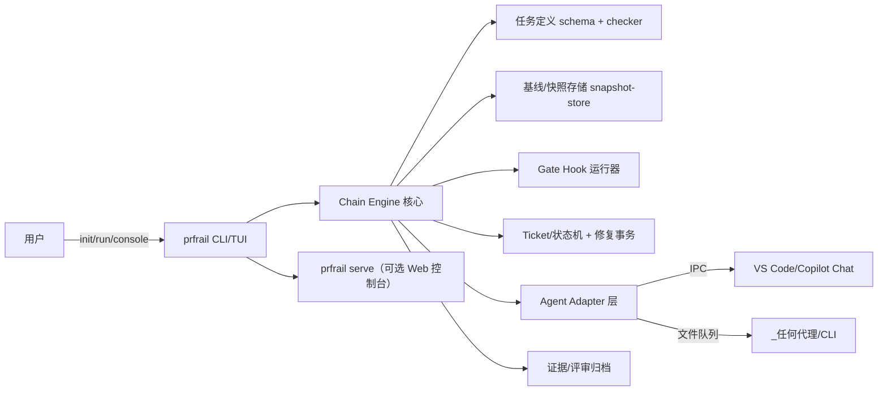

# RFC：ProofRail（证轨）—— AI 无人值守工程通用产品抽取方案

> 状态：提案（Proposal）。本文将 whois 项目中沉淀的 AI 无人值守工程最佳实践与应用经验，
> 规划为一个独立的通用产品项目，并给出命名、定位、架构与实施路线建议。
>
> 来源：基于对本仓库 `tools/test/`（约 125 个无人值守脚本）、`testdata/`（V1/Vx 任务定义体系）
> 与 `docs/`（RFC 与操作流程文档）的实战资产盘点。
>
> 补充（2026-08-28）：按“独立通用产品”定位新增 14 项需求的逐条可行性评估（第 9 节）、
> 核心概念与架构修订（第 10–13 节）与修订后的分阶段路线（第 14 节）。第 9–14 节为本轮生效的设计基线，
> 与第 1–8 节冲突时以第 9–14 节为准。

## 0. 项目命名

### 0.1 正式名称（推荐）

**ProofRail**（紧凑标识：**PrfRail**；工程名称：`prfrail`；中文名：**证轨**）

- 标语（Tagline）：*Provable rails for unattended AI engineering* —— 为 AI 无人值守编程铺设可证明的轨道。
- 命名解读：
  - **Proof（证明）**：直指本体系最核心的差异化能力——哈希绑定产物、幂等 marker、
    精确断言、promotion receipt 构成的"可证明写入"模型。AI 的每一次代码变更都有
    机器可验证的证据链，而非"跑完即信"。
  - **Rail（轨道/护栏）**：双关语义。既是 *guardrail*（护栏）——编辑边界矩阵、停机门禁、
    fail-close 状态机对 AI 权限的最小化约束；也是 *rail*（轨道）——first-fail-stop 的
    顺序执行语义让 AI 只能沿预定义轨道推进，不能自由发挥。
  - 正式名称完整表达产品定位；工程名称短小，适合作为仓库名、CLI、包名和模块前缀。
  - 中文名"证轨"两字对应 Proof/Rail，紧凑且技术气质鲜明。

### 0.2 名称分层与使用规范

采用 **ProofRail / PrfRail / `prfrail`** 的三级命名组合：

| 使用场景 | 写法 | 说明 |
|----------|------|------|
| 正式品牌、标题、对外文档 | **ProofRail** | 保留 Proof + Rail 的完整语义与品牌辨识度 |
| 紧凑视觉标识、空间受限界面 | **PrfRail** | 由 ProofRail 压缩而来，不将 `PR` 突出为独立缩写 |
| 仓库、CLI、可执行文件、包名和模块前缀 | `prfrail` | 全小写、无连字符，便于跨平台使用与检索 |
| 中文文档与传播 | **证轨** | 对应“证明/证据链 + 轨道/护栏” |

推荐示例：

```text
正式名称：ProofRail
紧凑标识：PrfRail
仓库名称：prfrail
CLI：prfrail
Go 模块：github.com/<org>/prfrail
中文名称：证轨
```

CLI 命令示例：

```bash
prfrail check
prfrail apply
prfrail verify
prfrail guard
prfrail inspect
prfrail promote
```

不建议将 **PRail** 作为正式名称或主要简称：在软件工程语境中，`PR` 通常首先被理解为
*Pull Request*，容易让产品被误认为仅面向 PR 检查或 PR 流水线。`PrfRail` 保留了
Proof 的来源提示，同时通过工程名称 `prfrail` 降低重名与语义歧义风险。

命名一致性规则：

1. README、RFC、官网和发布说明首次出现时使用 **ProofRail**。
2. 紧凑界面可使用 **PrfRail**，但首次出现时应注明其为 ProofRail 的紧凑标识。
3. 代码、命令、目录、制品和配置键统一使用小写 `prfrail`，避免混用 `prail`、`proofrail`
   或不同大小写变体。
4. 名称可用性会随时间变化；正式创建独立项目或商业发布前，应再次检查 GitHub、域名、
   语言包注册表及目标市场商标。

### 0.3 备选名称

| 备选 | 解读 | 未选为首选的原因 |
|------|------|------------------|
| **Veritask**（真验任务） | veritas（真理）+ task，强调任务执行的可验证性 | 侧重"任务"层，未覆盖护栏/边界语义 |
| **AegisPilot**（神盾领航） | Aegis（宙斯之盾）+ Pilot（领航/autopilot） | "Pilot" 在 AI 编码领域已被高度占用（Copilot 等），易混淆 |
| **SentinelForge**（哨兵工坊） | 哨兵（guard/watchdog）+ 锻造（代码变更） | 偏向监控语义，弱化了"可证明"这一核心卖点 |
| **FailClose** | 直接取自体系的核心安全原则 | 作为原则名极佳，但作为产品名偏负面 |

### 0.4 子模块命名建议

沿用铁路隐喻，并统一使用 `prfrail` 工程前缀：

- `prfrail-switch`（taskdef）：任务定义 schema 与静态 checker——"道岔"决定轨道走向。
- `prfrail-track`（applier）：原子执行引擎——列车只能沿轨道行驶。
- `prfrail-signal`（tickets）：票据生命周期与状态机——"信号灯"控制放行与阻断。
- `prfrail-guard`（guard）：进程监控与停机门禁。
- `prfrail-depot`（repair）：Prepare/Inspect/Validate/Promote 候选事务——"检修库"。
- `prfrail-gates`（gates）：可插拔验证门禁。

## 1. 总体结论：可行，且价值明确

whois 项目中的无人值守工程已经沉淀了一套完整、经过实战验证的体系，其核心思想与
whois 业务本身高度解耦，具备抽取为通用产品的条件。它解决的是一个通用问题：
**如何让 AI 代理在无人值守条件下安全、可审计、可恢复地执行代码变更任务**。
目前市面上的 AI 编码代理普遍缺乏这一层"工程化护栏"，这正是 ProofRail 的差异化定位。

## 2. 可抽取的核心资产盘点

从仓库现状看，与 whois 业务无关、可通用化的资产包括：

1. **任务定义 Schema 与静态检查体系**
   - V1 单文件 / Vx 多文件任务定义模型（target registry、稳定 target id、lifecycle、
     operation 全局排序）。
   - 独立 checker 的顺序内存文本语义、first-fail-stop、幂等 marker、pattern 收敛、
     replay 稳定性、精确 postApplyAssertions。
   - 哈希绑定产物（manifest/payload/target_set_sha256）。

2. **原子执行引擎（code-step）**
   - "读 → 全量预验证 → journal → 逐文件原子写入 → 写后验证 → 失败整组回滚"的事务模型。
   - journal/receipt/state 协议（可恢复提交）。

3. **票据驱动的故障处理与自愈框架**
   - guard/trigger/dispatch 的事件产票、结构化 category（task-static / code-fix / noncode）、
     fail-close 门禁。
   - 相同指纹预算三段状态机（pending_review → override_window → hard_block）、
     有效修复证据判定、防无限循环保护。
   - Prepare → Inspect → Validate → Promote 的隔离候选事务（candidate + 哈希绑定 +
     原子提升 + promotion receipt）。

4. **权限与边界模型**
   - 停机后才允许故障动作、只读状态票、跨轮次修改边界矩阵、轮次归属不可转移、
     编辑工具白名单/黑名单。
   - 自愈开关（self-heal enabled、cross-round repair enabled）与人工解锁规则。

5. **运行编排与可观测性**
   - stage window / supervisor / companion / session guard / watchdog 的进程编排。
   - 工单轮询 V2 的生命周期状态机、账本持久化、重启屏障、drain/recovery-drain。
   - start-file 身份绑定、快照完整性校验、心跳与健康检查。

6. **方法论文档**
   - 操作流程、授权边界（用户确认门禁）、任务切片设计与合并原则、低成本模型操作
     清单——这些是产品"最佳实践手册"的雏形。

## 3. 需要剥离的 whois 耦合点

- D1–D4/V1–V4 轮次语义中与 whois 编译/黄金/Step47 验证绑定的部分 → 抽象为可插拔的
  "验证阶段"接口，由使用方注入自己的构建/测试命令。
- C 语法门禁、`src/core/.task-static-*.c` 等语言特定检查 → 抽象为按语言可扩展的
  syntax gate 插件。
- VS Code 聊天投递（IPC chat sender、AHK 发送等）→ 抽象为"代理通道适配器"，
  支持不同 AI 代理接入方式（IDE 扩展、CLI 代理、API）。
- Windows/PowerShell 强绑定 → 见语言选择。

## 4. 语言与技术选型建议

当前实现以 PowerShell 5.1 为主，存在跨平台、可测试性、类型安全的天花板。建议：

- **核心引擎：Go**。理由：单二进制分发（与 whois 项目自身的 BusyBox 兼容哲学一致）、
  跨平台（Windows/Linux/macOS）、强并发原语适合进程编排与 watchdog、标准库覆盖文件
  原子操作与哈希、生态中已有成熟的正则/JSON Schema 工具。Rust 也可行，但 Go 的开发
  迭代速度更适合这个以流程编排为主的领域。
- **任务定义格式：保留 JSON（JSON Schema 正式化）**，同时评估提供 YAML/TOML 前端以
  改善人工可读性，内部统一规范化为 canonical JSON 后再做哈希绑定。
- **代理接口：定义协议而非绑定实现**。以本地文件队列 + 结构化 JSON 票据为基础协议
  （继承现有账本模型），提供 MCP server、CLI、HTTP 三种适配器，使任何 AI 代理
  （Copilot、Claude、本地模型）都能接入。
- **保留 PowerShell 兼容层（过渡期）**：为现有 whois 流程提供薄封装，使 whois 成为
  ProofRail 的第一个 dogfooding 用户，验证等价性后逐步切换。

## 5. 产品形态与模块划分

建议建立名为 `prfrail` 的独立仓库，模块划分（括号内为 0.4 节的品牌化命名）：

1. `taskdef`（switch）：任务定义 schema、解析、target registry、静态 checker。
2. `applier`（track）：原子执行引擎（journal、原子写、回滚、receipt）。
3. `tickets`（signal）：票据生命周期、账本、去重、状态机、指纹预算。
4. `guard`（guard）：进程监控、健康检查、停机门禁、watchdog。
5. `repair`（depot）：Prepare/Inspect/Validate/Promote 候选事务。
6. `gates`（gates）：可插拔验证门禁（syntax gate、构建、测试、黄金对比）。
7. `adapters`：代理通道（MCP/CLI/HTTP）与 IDE 集成。
8. `docs`：最佳实践手册（从现有中文 RFC 提炼，中英双语）。

## 6. 实施路线（分四个阶段）

1. **阶段一：规范固化**。将现有硬规则从 copilot-instructions 与各 RFC 中提炼为形式化
   规范文档（票据协议、任务定义 schema、编辑边界矩阵、事务状态机），补齐英文版。
   这一步不写代码，产出即有独立价值。
2. **阶段二：核心引擎重写**。用 Go 实现 taskdef checker 与 applier，以现有 PowerShell
   实现为参照做双跑等价性验证（同一任务定义、同一源码，比对 manifest 哈希与写入结果）。
   现有的 regression 脚本群可转化为新引擎的验收测试集。
3. **阶段三：编排与票据层迁移**。实现 guard/tickets/repair 模块，在 whois 仓库中并行
   试运行（影子模式：新引擎观察、旧引擎执行），确认票据判定一致后切换。
4. **阶段四：通用化与开放**。剥离最后的 whois 特定假设，提供示例项目（不同语言的
   目标仓库）、MCP 适配器与文档站，作为独立开源产品发布。

## 7. 关键风险与对策

- **规则复杂度过高吓退新用户**：现有体系为 whois 场景全量启用；产品化时应设计
  "分级模式"（基础原子应用 → 加票据自愈 → 加全套门禁），默认最小化配置。
- **双实现漂移**：阶段二/三必须以等价性测试为门禁，任何语义差异 fail-close，
  禁止"差不多就行"。
- **中文文档的国际化成本**：核心规范优先英文化，操作经验类文档可后置。
- **代理生态变化快**：把代理接口做成薄协议层，核心引擎不感知具体代理，降低生态
  变动冲击。
- **whois 自身演进冲突**：抽取期间 whois 的 Vx schema 处于冻结/慢改状态是有利窗口；
  建议在抽取仓库建立后，whois 侧新增无人值守能力一律先在 ProofRail 中实现再回灌。

## 8. 最有价值的独特卖点（产品定位参考）

- 首错即停 + 哈希绑定产物 + 原子提交回滚的"可证明写入"模型。
- 相同指纹预算与有效修复证据判定的"防 AI 无限循环"机制。
- 编辑边界矩阵与停机门禁的"AI 权限最小化"模型。
- 隔离候选事务（candidate 不污染正式定义）的自愈安全模型。

这四点在现有 AI 编码工具生态中均属稀缺，是 ProofRail 的核心竞争力所在，
也是"Proof + Rail"命名所直接指向的产品灵魂。
---

## 9. 需求评审（R1–R14，2026-08-28）

以下逐条评估用户提出的想法。总体原则：

- **产品域独立**：ProofRail 是面向“AI 无人值守工程”的通用产品，不承诺与 whois 的
  A/B 脚本、start-file、V1/Vx schema 保持接口兼容；whois 仅作为首个参考实现与
  dogfooding 场地（第 9.1 节）。
- **默认迁移语义**：现有 A/B 能力默认映射到“任务链 + 快照基线”新模型（第 10 节），
  不保留 A/B 命名作为产品概念。
- **可裁剪**：每项需求标注实施优先级 **P0（首版必备）/P1（重要，二期）/P2（可选，远期）**
  与保留（暂不纳入）。注意：**优先级（P）与实施阶段（S，见第 14 节）是两个独立维度**——
  例如某需求 Pri=P2，也可能按低成本在 S1 交付；P 只回答“重要性”，S 只回答“何时做”。

### 9.1 R1：独立通用产品，而非模仿 whois

- **评估**：合理，且是产品成立的前提。whois 的 A/B 是“单人、单仓库、C 语言、Windows 本地”
  的实例；ProofRail 应吸收其**通用机制**（可证明写入、票据状态机、编辑边界、门禁证据），
  而将 whois 特定语义（Step47、D1–D4、Preclass、CIDR）降级为“插件/示例”。
- **设计影响**：
  1. 领域模型以“**任务链（chain）**”“**基线快照（snapshot）**”“**门禁钩子（gate hook）**”
     “**代理会话（agent session）**”为一级概念，不再出现 A/B、stage、round 语义（可作为兼容别名）。
  2. whois 的 Phase/Gate/Round 命名仅用于 whois 示例包，不进入核心 schema。
  3. 产品 README/CLI/术语表一律通用化，禁止写死“A”“B”“D1”。
- **结论**：采纳（P0）。

### 9.2 R2：覆盖“任务定义设计 → 无人值守结束”全流程

- **评估**：合理。现有 A/B 已覆盖：任务定义编制（模板/校验）→ 启动预检 → 执行 →
  验证 → PASS/FAIL → 快照/基线恢复 → 下一任务。将这些固化为链运行时协议即可。
- **范围决策**：需求分析、产物规划、设计/测试方案等“产物前期要素”属于**产品管理的产物工程**，
  与“执行工程”耦合度低；纳入会显著增加复杂度（需求追踪、版本对齐、评审权限）。
  本轮**暂不纳入**（保留为 P2 候选：`prfrail-inception` 工作流，见第 14.4 节）。
- **设计影响**：
  1. 任务定义 = “一次链内步骤的完整规格”：基线输入、变更目标、门禁钩子、评审要求、输出快照。
  2. 链文档 = 任务清单 + 全局默认 + 每任务覆盖。
  3. `start-file` 概念替换为 `chain-file`（见第 13 节），字段分层，不再要求用户维护庞杂键值。
- **结论**：采纳（P0，链内全流程）；产物前期要素暂缓（P2）。

### 9.3 R3：多任务自动排序执行（1、2、3…），不限数量

- **评估**：合理且低成本。将“一个 A + 一个 B”泛化为“一个有序任务列表 T1…Tn”。
- **设计影响**：
  1. `chain-file` 的 `tasks[]` 为有序数组；执行器按序调度，支持暂停/继续/从 Ti 重跑。
  2. 第 i 项依赖第 i−1 项的快照；链级失败策略：`stop-on-fail`（默认）或 `skip-on-fail`（显式声明）。
  3. 支持“里程碑任务”（不产生源码变化、只做审查/冻结，映射为最小 noop + 证据）。
  4. 历史语义：A≈T1（初始基线），B≈T2（前一任务快照基线）；保留兼容映射但不作为产品概念。
- **结论**：采纳（P0）。

### 9.4 R4：任务初始源码基线确立 + 与仓库隔离

- **评估**：合理，且是去除“仓库依赖”的关键。当前 A 从 git baseline 恢复，要求仓库干净且
  依赖 git；通用产品不应假设控制仓库操作权限（远程/只读/多分支）。
- **设计影响**：
  1. **初始基线确立（baseline-0）**：任务链开始时，对产物项目当前源码树做**快照**
     （内容寻址：目录哈希 + 文件清单 + 包/锁文件 + 构建环境描述），写为 `baseline-0`
     （版本固定、不可变）。确立动作**只读**产物项目（不 checkout/reset/reset --hard，不改仓库状态）。
  2. **链内基线传播**：Ti 结束后若 PASS，固化为 `snapshot-i`；Ti+1 启动前恢复 `snapshot-i`
     （复制到工作目录/临时区），**不访问 git**。仓库操作（commit/push）由用户显式授权的外部动作，
     不进入链核心（与现有“无人值守期间禁止提交推送”一致并产品化）。
  3. 若用户明确要求“从仓库基线开始”，提供 `--baseline-mode=vcs` 高级选项（默认 `snapshot`）。
  4. 快照格式要可移植：zip/tar + manifest（SHA-256 清单），跨平台可恢复。
- **结论**：采纳（P0）。

### 9.5 R5：每个任务 PASS 时评审一次，取消 B 前评审

- **评估**：合理。现有 B 前评审是为了确认 A 快照可入链；链模型中“前一任务 PASS + 快照固化”
  即天然满足，无需单独评审点。
- **设计影响**：
  1. 每个任务 PASS 后执行评审门禁（gate kind=`review`）：输入 = 任务证据包
     （变更清单、门禁结果、产物哈希）；输出 = `approve` / `reject` / `waive`。
  2. 评审对象默认**代理/人工**：策略 `review.mode=auto|manual|hybrid`：
     - `auto`：低风险任务（无源码变更、纯验证）可自动通过；
     - `manual`：每任务要求用户批准；
     - `hybrid`（默认）：按风险规则（变更文件数、严重级门禁失败数、是否触网）自动放行或暂停等待。
  3. 评审记录（review receipt）作为证据写入链档案，与任务快照捆绑。
- **结论**：采纳（P0）。

### 9.6 R6：跨平台、多编辑器、多 harness、多 AI、按规则切换模型

- **评估**：方向正确；首版按“可移植核心 + 现有环境适配器”实现，避免一次性铺开。
- **设计影响（分层）**：
  1. **运行环境**：核心引擎与 CLI 为跨平台单二进制（建议 Go），桌面依赖（VS Code/聊天）
     通过适配器注入；首版支持 Windows 11 + Linux（Linux 至少覆盖 CLI/无 IDE 场景），
     macOS 视资源排期。
  2. **编辑器**：适配器接口 `editor-adapter`（VS Code 首版；CLI 为无编辑器模式）。
  3. **harness**：`harness` = 语言/项目模板，声明 build/test/verify 命令与产物约定；
     核心只消费 harness 结果证据（见 9.12）。
  4. **多 AI 接入**：`agent-adapter` 协议（票据 JSONL + 结果回执），首版：
     - `copilot-chat`（IPC 投递，见 9.7）；
     - `cli`（`prfrail agent run` 直连，供任何支持标准输入/输出的代理/模型）。
  5. **模型选择**：`model-policy`（任务、任务内阶段粒度的模型/档位映射与切换规则）：
     - 静态声明（初始）：`tasks[i].model=high|standard|lite` 或显式模型名；
     - 运行时切换（P1）：按结果质量/成本/失败指纹规则自动调整（如首错重现次数阈值），
       切换记录入证据；
     - 前端：策略存入 chain-file（用户可预设），模型详情由适配器解析。
- **结论**：采纳（P0 现有环境 + CLI；P1 多平台/多 AI/模型策略）。

### 9.7 R7：仅保留 IPC 投递，不引入 AHK 等兜底

- **评估**：同意。IPC 稳定成熟；AHK/剪贴板/编辑器注入属于 GUI 自动化，脆弱且不可审计。
- **设计影响**：
  1. 代理会话协议只定义两种通道：**IPC**（首版，VS Code 扩展内）与**文件队列**
     （跨进程、无 IDE 场景，结构化 JSONL + 回执，等价 IPC 语义）。
  2. 明确不支持：AHK、键盘模拟、剪贴板注入、窗口焦点控制；不再作为渠道进入 schema 或文档。
  3. IPC 与文件队列共享同一票据 ID/回执协议，可无缝互操作。
- **结论**：采纳（P0；文件队列作为跨平台通道纳入）。

### 9.8 R8：是否建立独立 AI 聊天系统？

- **评估结论**：**首版不需要独立聊天系统**。理由：
  - 聊天 UI/会话/身份/模型计费是独立工程域，重投入且与核心差异化（证明与护栏）无关；
  - 现有 VS Code Copilot Chat 已满足“人 + 代理”的交互载体；
  - 独立系统与“多编辑器、多 AI 接入”目标互相冲突（每接入一套就得再维护一个 UI）。
- **建议定位**：ProofRail 提供**代理会话协议**（adapters），聊天 UI 由宿主提供；
  只实现一个最小 CLI 会话工具（`prfrail agent`）作为无 IDE 场景的兜底入口。
- **后续候选**：若未来出现“无宿主、纯终端”市场，再评估 TUI/本地 Web 会话（P2，非承诺）。
- **结论**：不建独立聊天系统（P0）；保留 adapter 扩展点（P0）。

### 9.9 R9：可视化——三个独立终端窗口 vs 一体化设计

- **评估**：推荐**一体化优先，窗口化仅作诊断模式**。三窗口割裂、难审计、难回放；
  产品体验要求“一个入口看全局”。
- **设计影响**：
  1. 主形态：**单进程一体化工控台**：
     - `prfrail run`：前台 TUI（进度、当前任务、门禁结果、票据摘要、日志流）；
     - `prfrail serve`：本地 Web 控制台（可选，便于远端/多终端/复盘）；
     - 监控（guard/tickets/dispatch）为**内嵌后台服务**，不占独立窗口。
  2. 日志与证据：统一归档到链 run dir；TUI/Web 提供“时间线 + 证据链接”视图
     （任务 → 门禁 → 票据 → 评审 → 快照）。
  3. 兼容诊断模式：`--window-mode=legacy` 保留多窗口拆分（调试 only，非默认）。
  4. 首版（P0）：TUI 单窗口；Web（P1）；legacy（仅测试用）。
- **结论**：采纳（一体化；分步落地）。

### 9.10 R10：面向用户的可视化、低复杂度操作场景

- **评估**：合理。现有 start-file 键值庞杂（运行、监控、投递、恢复、预算等交错），
  不适宜用户手工维护。
- **设计影响**：
  1. 配置分层（可覆盖，schema 校验）：
     - `chain-file`（用户主视图：任务清单、每任务目标/门禁/评审要点）；
     - `workspace.toml`（环境适配：路径、工具链、远程主机、代理连接）；
     - `profiles/`（场景预设：`minimal`、`standard`、`strict`，封装批量默认键）；
     - `runtime-state/`（机器回填，用户不编辑）。
  2. 交互流程：`prfrail init`（向导生成链）→ `prfrail validate`（schema/预检）→ `prfrail run`
     （单命令）→ 控制台查看；高级字段仍可手改但默认隐藏。
  3. 派生键（心跳、投递、恢复）由引擎自动生成，不再放进用户配置；
     现 start-file 键值迁移到内部 state，仅保留少量公共可见键。
- **结论**：采纳（P0 配置分层 + 向导；P1 图形向导）。

### 9.11 R11：支持其它语言产品的开发

- **评估**：可行，是通用产品必然要求；核心与语言解耦，靠 harness 模板扩展。
- **设计影响**：
  1. 任务定义不含语言假设；语法/构建/测试/黄金均为钩子。
  2. 首个内置 harness：`c`（由 whois 实践提炼，覆盖 GCC/MinGW、静态链接、黄金比对）；
     另提供 `generic`（命令式 build/test/verify，任意语言）。
  3. 后续 harness（P1/P2）：`go`、`python`、`java`、`node`、`dotnet`——每个是
     “模板 + 门禁示例 + 文档”，不进入核心。
- **结论**：采纳（P0 generic + c；P1 更多语言包）。

### 9.12 R12：门禁/编译/验证采用钩子方式调用

- **评估**：必须。这是“验证阶段可插拔”的正式化，也是多语言支持的通道。
- **设计影响（gate hook 协议，v1）**：
  1. 钩子分类：`precheck`（环境）、`build`、`test`、`verify`（黄金/契约）、`review`、`cleanup`；
     每类可多钩子，按序执行。
  2. 钩子定义：`{name, kind, command|container, args, on-fail, artifact-glob, timeout}`；
     核心执行并收集：退出码、stdout/stderr 摘要、产物哈希；全部进入任务证据包。
  3. 失败策略：`fail-stop`（默认）、`warn`、`retry(n)`、`manual`。
  4. 钩子运行在产物工作区（快照恢复后的目录），不接触核心源码。
  5. 与“可证明写入”一致：钩子产出文件亦做哈希并绑定。
- **结论**：采纳（P0）。

### 9.13 R13：AI 按任务定义在前后编制生成门禁/验证脚本并自动挂载

- **评估**：可行且是较高级价值点，但**有安全边界**，需分级：
  - 场景 A（生成模板/命令拼装）：由 AI 从 harness 模板生成“参数化钩子命令”，低风险；
  - 场景 B（生成完整可执行脚本）：需沙箱、静态检查与人工/自动评审，高风险。
- **设计影响**：
  1. 任务定义钩子支持 `generated=true` + `template` + `spec`（需求描述、输入/输出约定、
     允许使用的工具白名单）；未生成/校验失败时任务不进入执行。
  2. 生成流程：代理任务（低风险档）→ 产物落 `generated/`（任务 run dir）→ **钩子校验**
     （语法检查、模板一致性、危险命令扫描）→ 挂载并绑定哈希。
  3. 安全约束：生成物只在隔离工作区执行；禁止网络出口（默认）；禁写核心源码与配置；
     产物全部进证据包；策略 `allow-generated-hooks=true|false`（默认 false）。
  4. 首版仅支持场景 A；场景 B 列入 P2（依赖沙箱与评审基础设施）。
- **结论**：采纳（P0 场景 A；P2 场景 B）。

### 9.14 R14：分阶段迭代实施

- **评估**：必须。现有第 6 节四阶段路线按新需求修订为**实施阶段 S0–S3**（详见第 14 节，
  与本节“优先级 P0–P2”不同维度）：
  S0 规格与领域模型 → S1 核心任务链（基线/快照/评审/钩子/单窗口 TUI/配置分层） →
  S2 语言与平台扩展（多 harness、Linux CLI、Web 控制台、模型策略） →
  S3 高级能力（生成钩子场景 B、多编辑器适配、inception 工作流）。
- **结论**：采纳（详见第 14 节，作为第 6 节路线图的更新版）。

### 9.15 暂不纳入清单（明确纪律）

以下内容在本轮明确**不纳入**首版设计，避免复杂度失控：

- 产物需求/规划/测试方案等前期要素（R2，P2 候选）。
- 独立 AI 聊天系统（R8）。
- AHK/剪贴板/键盘模拟等 GUI 兜底投递（R7）。
- 全自动跨仓库 CI 集成（保留手动触发与显式外部命令）。
- 任务执行中的实时模型热迁移（先支持静态/切换规则，不做运行时“自我换脑”重排）。

---

## 10. 核心概念修订：从 A/B 到“任务链 + 快照基线”

### 10.1 领域词汇表

| ProofRail 概念 | 定义 | whois 对应（仅示例） |
|---|---|---|
| `chain` | 有序任务列表（T1…Tn）与全局配置 | A/B 会话 |
| `task` | 链内一次变更步骤（输入快照 → 目标 → 钩子 → 评审 → 输出快照） | 一个 A 或 B |
| `baseline-0` | 链启动时对产物项目当前源码树的内容寻址快照（与仓库隔离） | A 的仓库基线恢复 |
| `snapshot-i` | Ti PASS 后固化的源码/产物快照 | B 启动所用 A 成功快照 |
| `gate hook` | 可插拔验证（环境/编译/测试/契约/评审），返回结构化证据 | Step47/CIDR/Golden |
| `evidence pack` | 任务证据包（变更、门禁结果、产物哈希、票据、评审receipt） | artifact 目录 + summary |
| `agent session` | 代理通道与回执协议（IPC / 文件队列 / CLI） | chat sender + dispatch |
| `chain state` | 运行期状态（引擎自动维护，用户不直接编辑） | start-file run 字段 |

### 10.2 链执行协议

```text
prfrail init <workspace>          # 向导：生成 chain-file + workspace 配置
prfrail baseline snapshot        # 确立 baseline-0（只读产物项目）
prfrail run <chain-file>          # 顺序执行 T1..Tn
  ┌─ Ti 开始：恢复 snapshot-(i-1)
  ├─ 执行：目标→代理会话→code change→钩子门禁（precheck/build/test/verify）
  ├─ PASS：固化 snapshot-i + 评审 receipt(auto/manual/hybrid)
  │    FAIL：证据包 + 票据（修复循环，遵守预算/边界，fail-close）
  └─ Ti+1 …
prfrail report <run-dir>          # 汇总链结果与证据链接
```

关键不变式：

1. 任何 Ti 只操作“快照工作区”，不触碰产物仓库状态（默认）；仓库写入仅由用户显式外部动作。
2. 每任务输出（源码+产物+证据）以哈希绑定，全部快照与 receipt 不可变。
3. 首错即停 + 单任务边界 + 编辑边界矩阵 + 停机门禁继续生效，仅作用域从“D 轮”变为“任务内步骤”。
4. 取消“B 前评审”；每任务 PASS 评审一次（9.5）。

---

## 11. 系统架构（修订）



- **Chain Engine**：无状态调度（进程、状态、锁），不感知语言与编辑器。
- **Gate Hook 运行器**：消费任务定义的钩子声明，执行并归一化证据（9.12）。
- **Taskdef**：schema 校验与静态 checker（继承现有 Vx 检查器设计：顺序语义、幂等、断言），
  语言无关。
- **Snapshot Store**：内容寻址存储（默认本地 `out/prfrail/snapshots/`，后续支持远端/对象存储）。
- **Agent Adapter**：协议化（票据 + 回执），IPC/文件队列/CLI 三通道，首版 IPC + 文件队列。
- **Tickets/修复事务**：按现有候选事务模型提炼，但 `candidate/validate/promote` 对象从
  “任务定义”泛化为“任务产物（含任务定义、生成钩子、补丁）”。

---

## 12. 安全与证据模型（延续不变式）

1. 哈希绑定：快照、证据包、评审 receipt、生成物均 SHA-256 绑定。
2. 权限最小化：AI 只能经代理会话拿到“任务契约 + 证据 + 有限工具白名单”。
3. 停机门禁：任何修复/重启动作前，先证据确认产物相关进程全部停止。
4. 预算与指纹：相同失败指纹计数，防止无限循环；预算耗尽进入人工等待。
5. 默认 fail-close：证据缺失、哈希不一致、评审未通过 → 不进入下一任务。

---

## 13. 用户体验（修订）

### 13.1 主入口

```text
prfrail init        # 向导：语言/项目类型 → 任务链模板 → 环境 → 生成 chain-file
prfrail validate    # schema + 预检（进程/锁/工具链/远程）
prfrail run         # 单命令执行，TUI 实时进度
prfrail report      # 链报告
prfrail serve       # 本地 Web 控制台（P1）
```

### 13.2 用户可见配置（默认隐藏派生键）

```toml
[chain]
tasks = ["T1", "T2", "T3"]
profile = "standard"

[[task]]
id = "T1"
name = "实现 XX"
model = "standard"
gates = ["precheck", "build", "test"]
review = "hybrid"

[workspace]
language = "c"
remote = { host = "10.0.0.199", user = "larson" }
agent = { channel = "ipc" }
```

机器派生键（心跳、票据域、恢复预算、投递细节等）全部由引擎维护在 `chain state`，
用户无需了解（对比现有 start-file：见 9.10）。

---

## 14. 修订后的分阶段路线图（替代第 6 节执行口径）

> 术语：本节 **S0–S3 为实施阶段**（何时交付）；第 9 节的 **P0–P2 为优先级**（多重要）。
> 两者正交：阶段划分按依赖与风险，优先级按价值；排程时用“优先级 × 阶段”矩阵决策。

| 阶段 | 目标 | 关键交付 | 验收标准 |
|---|---|---|---|
| **S0 规格化** | 领域模型与协议定稿 | chain/task/snapshot/gate/adapter 协议；样例（迁移 whois 的 C 场景）；术语表 | 文档可评审；示例链在 whois 上可“半自动”复现当前流程 |
| **S1 核心任务链** | 可运行的 MVP | Chain Engine、任务定义 checker（通用）、gate hook 运行器、IPC+文件队列 agent adapter、快照基线/传播/评审、TUI 单窗口、配置分层 | whois C 场景 T2 级流程全通过；证据/回滚/预算单测通过 |
| **S2 平台与语言扩展** | 走向通用 | Linux 支持（CI 可跑）、generic/go/python 等 harness、Web 控制台、模型策略（静态+切换规则）、远程执行抽象 | 至少 2 种非 C 语言示例链通过；跨平台 CI 绿 |
| **S3 高级能力** | 产品化完整闭环 | 生成钩子场景 B（沙箱+评审）、多编辑器适配、inception 工作流（需求→规划→测试要素）、多语言文档 | 独立开源发布；dogfood 与示例仓库全部接入 |

阶段门禁：每阶段结束时输出“阶段报告”（能力清单、未决项、下一步），并保持向后兼容的
协议冻结；任何跨阶段语义漂移以“等价性/契约测试”为准，禁止口头对齐。

---

## 15. 下一步（供评审决策）

1. 评审本补充（第 9–14 节）后，将 **S0/S1 范围**固化为 v0 实施计划（含 schema 草案与
   示例 chain-file）。
2. 建立 `prfrail` 独立仓库骨架（Go 模块 + CLI 起步，含 snapshot-store 与 gate hook 原型）。
3. whois 侧保持冻结；仅当 ProofRail **S1** 可对 whois 场景产生等价证据后，再启动 shadow 迁移。
4. 对 R6 的“模型切换规则”与 R13 的“生成钩子场景 B”单独做安全评审后再进入 **S2/S3**。

> 本补充由用户 14 条想法驱动（2026-08-28），作为产品基线合并入本 RFC；
> 之前第 0–8 节中与本补充冲突的表述（如 A/B 作为产品概念、四阶段路线）以本补充为准。