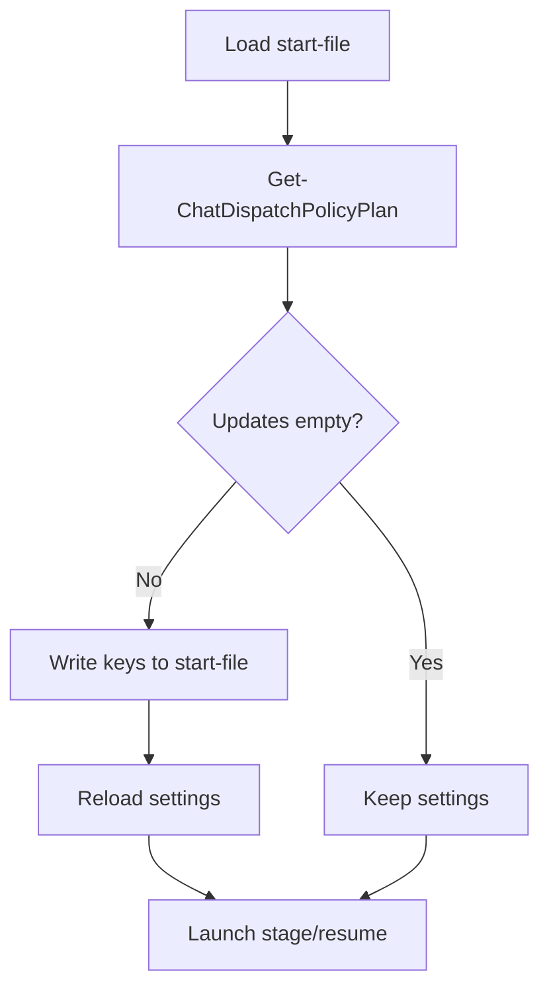

# RFC：无人值守聊天分发策略收敛 V1（源键驱动）

## 1. 目的

本文用于冻结 A/B 无人值守链路中的“聊天分发策略收敛”设计，解决以下长期痛点：
- 切换运行方式时需要手改多组 `AI_CHAT_DISPATCH_*` 与 trigger 命令参数，易漏改。
- stage/resume 启动脚本与 dispatch/trigger 实际行为存在配置漂移风险。
- final 总结票 auto-stop 只看 trigger 拉起，不保证 sender 实际送达。

本文给出 V1 方案：
- 仅修改少量策略源键（`AI_CHAT_POLICY_*`）。
- 在 stage/resume 启动时统一编译回写派生键。
- 在 trigger 端支持 `sender-sent` 终态守门。

状态：已实现并可用（V1）。

## 2. 范围

包含：
- 策略源键定义与归一化规则。
- 源键到派生键的编译回写契约。
- dispatch 主备发送链路（Python/AHK 双向主备 + fallback 开关）。
- trigger 终态守门（`trigger-started` / `sender-sent`）。

不包含：
- 新增第三种 sender。
- 变更业务工单事件语义。
- 调整 guard/supervisor 的核心调度策略。

## 3. 策略源键（V1）

建议日常仅修改以下 5 个键：

| 键名 | 取值 | 默认值 | 说明 |
| --- | --- | --- | --- |
| `AI_CHAT_POLICY_VERSION` | `1` | `1` | 策略版本标识 |
| `AI_CHAT_POLICY_WORK_MODE` | `normal` / `anti-missent` / `low-disturb` | `normal` | 工作模式 |
| `AI_CHAT_POLICY_DELIVERY_PRIMARY` | `pywinauto` / `ahk` | `pywinauto` | 主发送链路 |
| `AI_CHAT_POLICY_DELIVERY_FALLBACK` | `on` / `off` | `on` | 是否启用跨 sender 收底 |
| `AI_CHAT_POLICY_FINAL_STOP_GATE` | `trigger-started` / `sender-sent` | `trigger-started` | final auto-stop 守门方式 |

## 4. 值归一化规则

策略编译器在读取源键时会做归一化：
- `work_mode`：接受 `anti_missent`、`anti-mis-send`、`low_disturb`、`lowdisturb` 等别名。
- `delivery_primary`：接受 `python`、`py`、`autohotkey` 等别名，统一归一为 `pywinauto` / `ahk`。
- `delivery_fallback`：接受 `true/false`、`enabled/disabled`。
- `final_stop_gate`：接受下划线别名（`sender_sent`、`trigger_started`）。
- 不合法值回退到默认值或 legacy 推导值。

## 5. 编译器契约

实现入口：`tools/test/chat_dispatch_policy_compiler.ps1`

核心函数：
- `Get-ChatDispatchPolicyPlan`
- `Convert-ToDispatchSenderSwitchSanitizedCommand`

编译输出包含三部分：
- `Updates`：需要写回 start-file 的键值。
- `Changes`：本次修正说明（用于日志）。
- `ResolvedPolicy`：最终策略视图（用于 stage/resume 输出摘要）。

### 5.1 派生键写回（核心）

编译器会按源键回写/修正以下关键派生键：
- `AI_CHAT_DISPATCH_DELIVERY_PROFILE`
- `AI_CHAT_DISPATCH_STATUS_REPORT_INTERACTIVE`
- `AI_CHAT_DISPATCH_ACTIVE_WINDOW_ONLY`
- `AI_CHAT_DISPATCH_STATUS_REPORT_ALLOW_INCONCLUSIVE_SUBMIT`
- `AI_CHAT_DISPATCH_USE_PY_SENDER`
- `AI_CHAT_DISPATCH_USE_AHK`
- `AI_CHAT_DISPATCH_SENDER_PRIMARY`
- `AI_CHAT_DISPATCH_SENDER_FALLBACK_ENABLED`
- `AI_CHAT_TRIGGER_FINAL_STOP_GATE`
- `AI_CHAT_DISPATCH_AHK_EVENT_ALLOWLIST`
- `AI_CHAT_TRIGGER_EVENT_DRIVEN_QUEUE`
- `AI_CHAT_TRIGGER_DISPATCH_STATUS_REPORTS`
- `AUTO_START_TAKEOVER_TRIGGER`
- `EXTERNAL_TRIGGER_EXECUTE`

### 5.2 trigger 命令净化

编译器会移除 `EXTERNAL_TRIGGER_COMMAND` 中的 sender 强制开关：
- `-UsePythonSender`
- `-UseAhk`

目的：避免 trigger 命令硬编码覆盖策略源键。

## 6. 启动时序

`open_unattended_ab_stage_window.ps1` 与 `open_unattended_ab_resume_window.ps1` 在加载 start-file 后统一调用策略编译器。

行为：
- 若 `Updates` 非空：回写 start-file 并重新加载 settings。
- 若 `Updates` 为空：输出 `dispatch_policy_guard status=PASS`。

流程示意：

## 7. 模式语义

### 7.1 工作模式

- `normal`
  - 交互分发开启。
  - 包含 `running-status-report` 在 allowlist 中。
- `anti-missent`
  - 交互分发开启。
  - 强制 `AI_CHAT_DISPATCH_ACTIVE_WINDOW_ONLY=true`。
- `low-disturb`
  - 状态票走 relay，但不进行交互发送。
  - `running-status-report` 不进入交互发送 allowlist。

### 7.2 主备投送

- `pywinauto + on`：Pywinauto 主投送，AHK 收底。
- `pywinauto + off`：仅 Pywinauto。
- `ahk + on`：AHK 主投送，Pywinauto 收底。
- `ahk + off`：仅 AHK。

## 8. dispatch 主备链路（V1 行为）

实现入口：`tools/test/dispatch_takeover_to_chat.ps1`

### 8.1 Python 主投送时

当 `CrossSenderFallbackEnabled=true` 时：
- Python watchdog timeout 可回退到 AHK。
- `running-status-report` 出现典型 unsent 原因（如 `python-send-reported-unsent`）可回退到 AHK。

### 8.2 AHK 主投送时

当 `CrossSenderFallbackEnabled=true` 且 AHK 未发送成功时：
- 对关键事件（含 `running-status-report`、`chat-session-final-status`、`incident-captured` 等）可回退到 Python。

### 8.3 可观测性

dispatch 会在 relay state 中写入 sender 结果：
- `sender_mode`
- `sender_sent`
- `sender_reason`
- `sender_fallback_enabled`

该状态文件被 trigger 的 final gate 读取。

## 9. final auto-stop 守门

实现入口：`tools/test/unattended_ab_takeover_trigger.ps1`

### 9.1 `trigger-started`（兼容旧行为）

- 仅要求 final 分发 trigger 已成功拉起。
- 不校验 sender 是否真正发送。

### 9.2 `sender-sent`（严格守门）

trigger 在 `chat-session-final-status` 场景下额外校验：
- `latest_relay_<start-token>.json` 存在。
- 事件为 `chat-session-final-status`。
- 票据匹配（或满足会话起始后的新鲜状态条件）。
- `sender_sent=true`。

若未确认：
- 记录 `auto_stop_deferred reason=final-dispatch-sender-not-confirmed`。
- 继续等待下一轮，不立即 auto-stop。

## 10. 兼容性与迁移

- 当源键缺失时，编译器会从 legacy 键推导默认值（平滑兼容）。
- 旧脚本中手工维护的 `AI_CHAT_DISPATCH_*` 仍可保留，但建议逐步收敛到“只改 5 个源键”。
- CLI 显式 sender 开关依旧具有最高优先级；模板已移除该硬编码，避免意外覆盖。

## 11. 已落地文件

- 策略编译器：`tools/test/chat_dispatch_policy_compiler.ps1`
- stage 接入：`tools/test/open_unattended_ab_stage_window.ps1`
- resume 接入：`tools/test/open_unattended_ab_resume_window.ps1`
- dispatch 主备行为：`tools/test/dispatch_takeover_to_chat.ps1`
- trigger final gate：`tools/test/unattended_ab_takeover_trigger.ps1`
- 运行态/静态热切入口：`tools/test/switch_unattended_chat_dispatch_policy.ps1`
- 模板与 start-file：
  - `docs/UNATTENDED_AB_START_TEMPLATE_CN.md`
  - `testdata/unattended_start/active/unattended_ab_start_20260519-0227.md`
  - `testdata/unattended_start/smoke/unattended_ab_start_status_ticket_smoke.md`
  - `testdata/unattended_start/smoke/unattended_ab_start_status_ticket_low_disturb_smoke.md`

## 12. 验证结论（本轮）

- 关键脚本语法（Parser）通过。
- 策略编译器 PSScriptAnalyzer 通过（命名告警已清理）。
- active start-file 上策略编译输出正常：
  - `work_mode=normal`
  - `delivery_primary=pywinauto`
  - `delivery_fallback=on`
  - `final_stop_gate=trigger-started`

## 13. 操作建议

建议按“策略源键优先”维护：
- 日常切换模式，只改 5 个 `AI_CHAT_POLICY_*` 键。
- 不在 `EXTERNAL_TRIGGER_COMMAND` 中手工添加 sender 开关。
- 对生产场景建议逐步评估 `AI_CHAT_POLICY_FINAL_STOP_GATE=sender-sent`，以提升 final 总结票可达性保障。
- 运行中/未运行时均可通过热切脚本一次切换四项策略并自动编译派生键：
  - 预览变更（不落盘）：
    - `powershell -NoProfile -ExecutionPolicy Bypass -File tools/test/switch_unattended_chat_dispatch_policy.ps1 -StartFile testdata/unattended_start/active/unattended_ab_start_20260519-0227.md -WorkMode low-disturb -DeliveryPrimary ahk -DeliveryFallback off -FinalStopGate sender-sent -DryRun`
  - 落地变更（立即生效到 start-file）：
    - `powershell -NoProfile -ExecutionPolicy Bypass -File tools/test/switch_unattended_chat_dispatch_policy.ps1 -StartFile testdata/unattended_start/active/unattended_ab_start_20260519-0227.md -WorkMode normal -DeliveryPrimary pywinauto -DeliveryFallback on -FinalStopGate trigger-started`

---

版本记录：
- V1（2026-05-25）：首次冻结源键驱动策略收敛方案。
